# 文韵智途 — 数据库 E-R 图

> 基于云端 Supabase 真实 schema（2026-05-11），18 张业务表 + 7 种枚举。

```mermaid
erDiagram
    %% ===== 身份与班级 =====
    profiles {
        uuid id PK "→ auth.users.id"
        text login_id UK "8位学号/工号"
        text password_hash
        text role "admin | teacher | student"
        text display_name
        text status "active | disabled"
        timestamptz created_at
        timestamptz updated_at
    }

    classes {
        uuid id PK
        text name UK
        text grade
        text status "active | archived"
        uuid created_by FK
        timestamptz created_at
        timestamptz updated_at
    }

    class_memberships {
        uuid id PK
        uuid class_id FK
        uuid profile_id FK
        app_role role "teacher | student"
        timestamptz created_at
    }

    %% ===== 学习过程 =====
    text_projects {
        uuid id PK
        uuid owner_id FK
        uuid class_id FK
        text title "篇目名"
        text author
        text text_type "poem | prose | ..."
        text classification_state "pending | classified | failed | manual"
        integer highest_bloom_level "1-6"
        timestamptz created_at
        timestamptz updated_at
    }

    conversations {
        uuid id PK
        uuid owner_id FK
        uuid class_id FK
        uuid project_id FK "NULL=日常会话归档"
        interaction_source source "student_chat | teacher_chat | practice"
        uuid prompt_preset_id FK
        text title
        timestamptz deleted_at "软删除"
        timestamptz created_at
        timestamptz updated_at
    }

    conversation_messages {
        uuid id PK
        uuid conversation_id FK
        text role "user | assistant | system | tool"
        text content
        jsonb parts "AI SDK多段结构"
        integer bloom_level "1-6"
        text bloom_state "pending | classified | failed | unclassified"
        text model_id
        timestamptz created_at
    }

    practice_records {
        uuid id PK
        uuid student_id FK
        uuid project_id FK
        smallint target_bloom_level "1-6"
        text prompt
        text answer
        text feedback
        boolean achieved
        text evaluation_state "pending | evaluated | failed | blocked"
        timestamptz created_at
    }

    %% ===== RAG 语料 =====
    documents {
        uuid id PK
        uuid owner_id FK
        uuid class_id FK
        uuid project_id FK
        uuid conversation_id FK
        text title
        text author
        text dynasty
        text content
        text source_uri
        jsonb metadata
        timestamptz created_at
        timestamptz updated_at
    }

    document_chunks {
        uuid id PK
        uuid document_id FK
        uuid owner_id FK
        uuid class_id FK
        uuid project_id FK
        uuid conversation_id FK
        integer chunk_index
        text content
        integer token_count
        jsonb metadata
        vector_1536 embedding "HNSW cosine"
        timestamptz created_at
    }

    %% ===== 教学数据 =====
    audit_records {
        uuid id PK
        uuid source_message_id FK
        uuid source_conversation_id FK
        uuid auditor_id FK
        uuid class_id FK
        audit_kind kind "sft | dpo | metadata"
        audit_status status "approved | exported"
        text prompt
        text original_answer
        text corrected_answer
        text chosen_answer
        text rejected_answer
        text quality
        text rationale
        jsonb metadata
        timestamptz exported_at
        timestamptz created_at
        timestamptz updated_at
    }

    export_batches {
        uuid id PK
        audit_kind export_type "sft | dpo | metadata"
        export_status status "queued | ready | failed"
        integer record_count
        text jsonl
        uuid created_by FK
        timestamptz created_at
    }

    %% ===== AI 能力配置 =====
    provider_configs {
        uuid id PK
        text name
        text provider_type "openai | gateway | anthropic | ..."
        text base_url
        text secret_ref
        text secret_last_four
        boolean is_enabled
        text health_status
        jsonb api_models
        timestamptz last_health_check_at
        integer last_health_latency_ms
        uuid created_by FK
        timestamptz created_at
        timestamptz updated_at
    }

    provider_capabilities {
        uuid id PK
        uuid provider_id FK
        provider_capability capability "8种能力枚举"
        text model_id
        boolean is_enabled
        jsonb metadata
    }

    model_tier_bindings {
        uuid id PK
        text tier UK "flash | advanced"
        uuid provider_id FK
        text model_id
        boolean is_enabled
        jsonb metadata
        timestamptz created_at
        timestamptz updated_at
    }

    scenario_tier_bindings {
        uuid id PK
        provider_capability scenario UK "8种能力枚举"
        text tier "flash | advanced"
        boolean is_enabled
        jsonb metadata
        timestamptz created_at
        timestamptz updated_at
    }

    mcp_servers {
        uuid id PK
        text name
        text description
        text connection_ref
        text secret_ref
        text secret_last_four
        text health_status
        jsonb enabled_tools
        app_role_array allowed_roles "教师/学生"
        jsonb metadata
        boolean is_enabled
        uuid created_by FK
        timestamptz created_at
        timestamptz updated_at
    }

    prompt_presets {
        uuid id PK
        text title
        text scenario
        text system_instruction
        text user_template
        jsonb variables
        app_role target_role "teacher | student"
        prompt_preset_status status "draft | published | disabled"
        integer version
        uuid created_by FK
        timestamptz created_at
        timestamptz updated_at
    }

    %% ===== 运维观测 =====
    data_quality_events {
        uuid id PK
        text event_type
        text table_name
        integer record_count
        text reason
        jsonb payload
        timestamptz created_at
    }

    %% ===== 关系 =====
    profiles ||--o{ class_memberships : "has"
    classes ||--o{ class_memberships : "contains"
    profiles ||--o{ text_projects : "owns"
    classes ||--o{ text_projects : "scopes"
    profiles ||--o{ conversations : "owns"
    text_projects ||--o{ conversations : "contains"
    classes ||--o{ conversations : "scopes"
    prompt_presets ||--o{ conversations : "used_by"
    conversations ||--o{ conversation_messages : "contains"
    profiles ||--o{ practice_records : "attempts"
    text_projects ||--o{ practice_records : "targets"
    profiles ||--o{ documents : "owns"
    text_projects ||--o{ documents : "scopes"
    conversations ||--o{ documents : "scopes"
    documents ||--o{ document_chunks : "split_into"
    conversation_messages ||--o{ audit_records : "source"
    conversations ||--o{ audit_records : "source"
    profiles ||--o{ audit_records : "audits"
    classes ||--o{ audit_records : "scopes"
    profiles ||--o{ export_batches : "creates"
    provider_configs ||--o{ provider_capabilities : "provides"
    provider_configs ||--o{ model_tier_bindings : "bound_to"
```

## 表间关系说明

| 关系 | 说明 |
| --- | --- |
| `profiles → class_memberships → classes` | 学生/教师通过成员表归属班级；学生单班（部分唯一索引强制） |
| `profiles → text_projects` | 学生拥有篇目项目；同一学生同一篇目只有一个项目 |
| `text_projects → conversations` | 项目下的会话；`project_id = NULL` 表示日常会话归档 |
| `conversations → conversation_messages` | 会话包含多轮消息 |
| `text_projects → practice_records` | 项目的挑战记录；通过触发器自动同步 `highest_bloom_level` |
| `documents → document_chunks` | RAG 语料切片；`embedding vector(1536)` + HNSW 索引 |
| `conversation_messages → audit_records` | 教师核实后物化的 SFT/DPO/metadata 样本 |
| `provider_configs → provider_capabilities` | Provider 提供的能力绑定 |
| `provider_configs → model_tier_bindings → scenario_tier_bindings` | 三层能力路由 |

## 关键约束

- `text_projects_prevent_delete` 触发器：项目不可删除（CONTEXT.md：学生项目不支持删除）
- `class_memberships_one_student_class_idx`：学生单班（部分唯一索引，CONTEXT.md：学生账号在 MVP 中只允许归属一个班级）
- `text_projects_owner_title_normalized_key`：同一学生同一篇目唯一（`lower(trim(title))`，CONTEXT.md：同一个学生对同一个篇目始终只有一个项目）
- `conversations.deleted_at`：软删除 + 条件偏索引（CONTEXT.md：产品语义是删除，数据实现语义按软删除设计）
- `validate_conversation_message_contract` 触发器：
  - 阻止向已软删除的会话插入消息
  - **阻止学生向已 finalized 的会话插入消息**（CONTEXT.md：会话级最终提交后，学生侧不能在这个会话继续追问）
  - 布鲁姆认知路径只对 student_chat + 有项目归属的 user 消息生效
- `audit_records_validate_contract` 触发器：
  - 只允许 `student_chat` + 有项目 + 有班级的会话进入审阅（CONTEXT.md：日常会话归档不进入教师教学正确性核实）
  - 按 `kind` 校验必填字段（SFT 需要 answer，DPO 需要 chosen ≠ rejected）
  - 教师只能审阅自己班级的记录
- `audit_status` 枚举：仅 `approved`（教师已审批，等待导出）和 `exported`（管理员已导出）。没有 pending/rejected 中间态——会话级最终提交本身就是审批动作（CONTEXT.md：确认提交整个会话）
- `practice_records_one_pending_per_project` 部分唯一索引：同一学生同一项目同一时刻只能存在一条 `evaluation_state='pending'` 的挑战（CONTEXT.md：同一项目挑战防重）
- `practice_records_sync_project_bloom` 触发器：挑战通过后自动更新项目最高层级
- `validate_class_membership_contract` 触发器：班级成员角色只能是 teacher 或 student

## 本地 Migration 文件说明

| 文件 | 作用 |
| --- | --- |
| `00000000000000_baseline_schema.sql` | 参考文件，记录云端 21 条 migration 历史清单 |
| `20260511000001_db_optimization_phase1.sql` | 索引优化 + 冗余 RLS 清理 + search_path 修复 |
| `20260511000002_security_definer_lockdown.sql` | SECURITY DEFINER 函数权限收紧 |
| `20260511060200_block_messages_in_finalized_conversations.sql` | 修复 CONTEXT.md 规则缺口：finalized 会话阻止学生续问 |
| `20260520113834_fix_refresh_project_highest_bloom_level_continuity.sql` | 项目最高层级使用从 L1 起的连续通过层级 |
| `20260520115516_fix_is_student_conversation_finalized_grant.sql` | 授权 authenticated 角色调用 finalized 检查 RPC |
| `20260520120709_practice_records_one_pending_per_project.sql` | 部分唯一索引 + 触发器，固化"同一项目同时只能有一条待作答挑战" |
| `20260520120805_conversations_soft_delete_rejects_pending_audits.sql` | _已被 20260520123251 取消_：软删除清理触发器，因 audit_status 移除 pending 后不再需要 |
| `20260520121251_audit_records_ban_pending_for_final_kinds.sql` | _已被 20260520123251 取消_：原本在触发器层 ban pending，被枚举层面取消取代 |
| `20260520123251_audit_status_collapse_to_terminal_states.sql` | 第一性原理重构：`audit_status` 收敛为 `approved \| exported`，移除幽灵状态及附带触发器 |

> 本地 migration 文件与云端 `supabase_migrations.schema_migrations` 表对齐。
> 旧的 18 个不一致的草稿 migration 文件已在 2026-05-11 清理。
