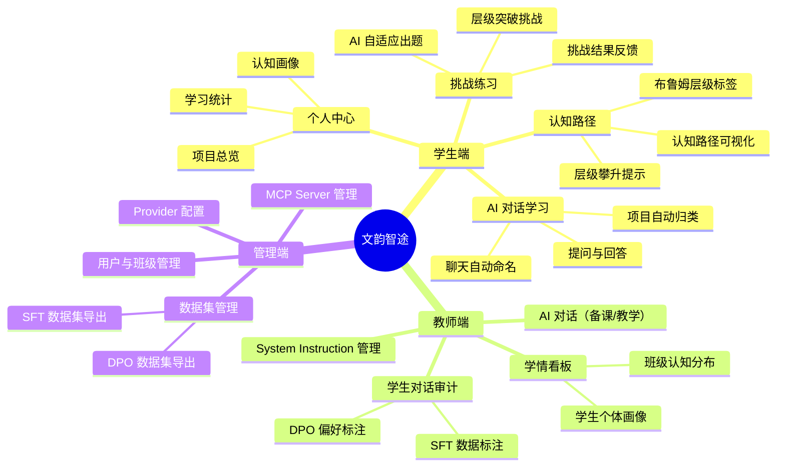
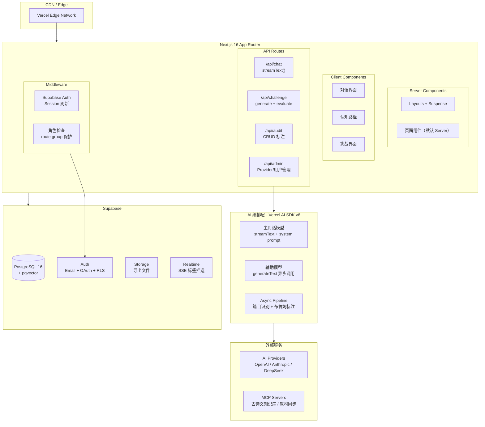

## 一、产品概述

### 1.1 产品定位

文韵智途是一款面向中学古诗词与文言文教学场景的 AI 智能助手，以**布鲁姆认知层次（Bloom's Taxonomy）**为核心教学理论框架，通过 AI 对话驱动学习，将每一次提问转化为可追踪的认知路径，让学生"看得见自己的成长"，让教师"握得住学情的数据"，并在此过程中自然产出高质量的 SFT/DPO 训练数据集。

### 1.2 核心价值主张

- **对学生**：不再只是"问一道题、得一个答案"，而是沿着布鲁姆认知阶梯从记忆走向创造，看到自己在一首诗上的认知全景图
- **对教师**：AI 不是替代教师，而是教师的"助教"——教师可审计每次 AI 对话，纠正错误、掌握学情，同时审计过程即为数据标注过程
- **对管理员/机构**：教学过程天然产出高质量领域数据集，实现"用中学、学中产"的闭环

### 1.3 布鲁姆认知层次模型

本产品的教学理论基石为布鲁姆认知领域六个层次。一个问题有布鲁姆认知路径，路径的最后一个节点是该问题最高的布鲁姆认知层次！

| 层级 | 名称     | 核心能力   | 古诗词场景举例                             |
| ---- | -------- | ---------- | ------------------------------------------ |
| L1   | **记忆** | 识别与回忆 | 背诵"鹅鹅鹅，曲项向天歌"                   |
| L2   | **理解** | 解释与释义 | 解释"曲项"一词的含义                       |
| L3   | **应用** | 迁移与运用 | 用"白描"手法写一句描写动物的句子           |
| L4   | **分析** | 分解与比较 | 比较《咏鹅》与《画》的写法异同             |
| L5   | **评价** | 判断与论证 | 评价"白描是否是这首诗最核心的手法"         |
| L6   | **创造** | 重组与生成 | 仿照《咏鹅》的写法创作一首描写其他动物的诗 |

---

## 二、用户角色与权限模型

### 2.1 角色定义

```
┌─────────────────────────────────────────────────────────────┐
│                        管理员 (Admin)                        │
│  ┌─────────────────────────────────────────────────────────┐ │
│  │                      教师 (Teacher)                      │ │
│  │  ┌─────────────────────────────────────────────────────┐│ │
│  │  │                   学生 (Student)                     ││ │
│  │  └─────────────────────────────────────────────────────┘│ │
│  └─────────────────────────────────────────────────────────┘ │
└─────────────────────────────────────────────────────────────┘
```

### 2.2 权限矩阵

| 功能模块                |   学生    |       教师        | 管理员 |
| ----------------------- | :-------: | :---------------: | :----: |
| AI 对话（学习）         |     ✅     |         ✅         |   ❌    |
| 布鲁姆认知路径查看      | ✅（本人） | ✅（所教班级学生） |   ❌    |
| 挑战练习                |     ✅     |         ❌         |   ❌    |
| 个人中心 / 学习档案     | ✅（本人） | ✅（所教班级学生） |   ❌    |
| System Instruction 预设 |     ❌     |         ✅         |   ❌    |
| 对话审计与标注          |     ❌     |         ✅         |   ❌    |
| SFT/DPO 数据集预览      |     ❌     |     ✅（只读）     |   ✅    |
| MCP / Provider 配置     |     ❌     |         ❌         |   ✅    |
| 用户管理 / 班级管理     |     ❌     |         ❌         |   ✅    |
| 数据集导出              |     ❌     |         ❌         |   ✅    |

### 2.3 数据关系模型

```
学校 School
  └── 年级 Grade
        └── 班级 Class
              ├── 学生 Student (一个学生可属一个班，一个班多个学生)
              └── 教师 Teacher (一个教师可代多个班)
                    └── 授课关系 TeacherClass 
```

---

## 三、功能架构总览



---

## 四、核心功能详细设计

### 4.1 AI 对话系统（学生端 & 教师端）

#### 4.1.1 对话主界面

对话界面采用经典聊天布局，左侧为项目列表，右侧为对话区域。关键差异点在于：

- **项目自动归类**：学生提问后，后台异步调用分类模型，识别问题所属的古诗文篇目，自动将对话归入对应项目，并重命名聊天标题
- **布鲁姆认知路径实时渲染**：每个用户消息气泡上方显示该问题所属的布鲁姆认知路径。
- **布鲁姆认知层次统计：**一个聊天记录会话里可能涉及多个布鲁姆认知路径，一个路径有多个层次，一个会话显示该会话中涉及过的布鲁姆层次统计！
- **AI 教学模式**：AI 的回答不只是"给答案"，而是按教育学策略引导——先确认认知层级，再以苏格拉底式提问引导学生向上攀升

**交互流程**：

```
用户输入问题 → 前端发送请求 → [并行]
  ├→ 主模型生成教学回答（流式返回前端）
  ├→ flash模型：识别所属篇目 → 自动归类 + 重命名聊天
  └→ flash模型：判断布鲁姆 → 返回标签 → 前端渲染徽章
```

#### 4.1.2 项目自动归类逻辑

后台在用户发送第一条消息后，异步执行以下 Pipeline：

1. **篇目识别**：调用 LLM，Prompt 为"判断以下问题属于哪篇古诗文"，返回篇目名称及作者（如"《咏鹅》- 骆宾王"）
2. **项目匹配**：在数据库中查找该学生是否已有该篇目的项目
   - 若已有 → 将当前对话归入该项目
   - 若没有 → 创建新项目，将对话归入
3. **对话重命名**：将聊天标题从默认的"新对话"重命名为"《咏鹅》- 关于白描手法的讨论"之类的语义化标题

#### 4.1.3 布鲁姆层级标注

每次用户提问后，后台异步调用标注模型，Prompt 设计如下：

```
你是一位教育学专家。请根据布鲁姆认知层次理论，判断以下学生问题属于哪个认知层级。

布鲁姆六层级：
L1-记忆：回忆事实、背诵原文
L2-理解：解释含义、概括主旨
L3-应用：将知识迁移到新情境
L4-分析：比较、分解、找关系
L5-评价：判断价值、论证观点
L6-创造：仿写、创作、重组

学生问题：{question}
上下文（所属篇目）：{poem_title}

请仅返回 JSON：{"level": 1, "label": "记忆", "confidence": 0.92}
```

前端接收标注结果后，在消息气泡上方渲染对应颜色的布鲁姆徽章。

### 4.2 布鲁姆认知路径可视化（学生端）

这是本产品的核心差异化体验。学生在一个项目（即一首诗/一篇文言文）下的所有提问，构成该学生在该篇目上的认知路径。

#### 4.2.1 认知路径图

采用**阶梯式路径图**的设计隐喻——一座向上攀升的台阶，每一级台阶代表一个布鲁姆层级，台阶上放置该层级对应的问题节点。

```
                    ┌──────┐
                    │ L6   │  ← 创造（未解锁，灰色）
                    │创造  │
              ┌─────┴──────┤
              │ L5   ●     │  ← 评价（已有1个问题，金色）
              │评价  │     │
        ┌─────┴──────┤    │
        │ L4   ●  ●  │    │  ← 分析（已有2个问题，蓝色）
        │分析  │  │  │    │
  ┌─────┴──────┤    │    │
  │ L3   ●     │    │    │  ← 应用（已有1个问题，绿色）
  │应用  │     │    │    │
  ├──────┤     │    │    │
  │ L2 ● ● ●  │    │    │  ← 理解（已有3个问题，浅蓝）
  │理解│  │  │ │    │    │
  ├────┤  │  │ │    │    │
  │ L1 ●  │  │ │    │    │  ← 记忆（已有1个问题，灰色）
  │记忆│  │  │ │    │    │
  └────┴──┴──┴─┴────┴────┘
```

**设计规格**：
- 已有问题的层级以**实心圆点**标记，颜色按层级区分
- 未涉及的层级以**虚线轮廓**显示
- 当前最高已触及层级以**金色光晕**强调
- 点击某个圆点可展开该问题的完整对话记录
- 整体配色采用中国传统色系：L1 黛蓝、L2 天青、L3 竹青、L4 赭石、L5 朱砂、L6 紫金

#### 4.2.2 个人中心 — 项目总览

个人中心以**卡片网格**布局展示学生涉猎过的所有古诗文项目，每张卡片包含：

- 篇目名称及作者（如"《静夜思》- 李白"）
- 一张缩略版认知阶梯图（只显示已触及层级的高亮条）
- 最高认知层级标签（如"当前最高：L4 分析"）
- 问题总数 & 最后学习时间
- 挑战完成进度（如"3/6 层级已通过"）

卡片支持按"最近学习"、"认知深度"、"问题数量"排序。

#### 4.2.3 个人中心 — 认知画像

提供一个**雷达图**，六轴对应布鲁姆六层级，展示该学生在所有项目中的认知能力分布。此图帮助学生感知自己在哪些层级较为薄弱（如大量问题集中在 L1-L2，L4 以上极少），AI 也会据此给出引导建议。

### 4.3 挑战练习系统（学生端）

#### 4.3.1 挑战机制

挑战是学生主动攀升布鲁姆层级的途径。学生在一个项目下点击"开始挑战"后，系统根据其当前已触及的最高层级，从**下一层级**开始出题。

**出题逻辑**（后台调用 LLM）：

```
你是一位古诗文教学专家。学生正在学习《{poem_title}》。
学生当前已触及的最高布鲁姆层级为 L{current_level}。学生的年级是{grade}
请为 L{target_level}（{level_name}）层级出一道挑战题。

要求：
1. 题目必须严格对应 L{target_level} 的认知要求
2. 题型可以是：填空、简答、仿写、评论、创作（根据层级不同）
3. 难度适中，学生有 60%-70% 的概率能答对
4. 返回 JSON：{"question": "...", "type": "...", "hint": "..."}
```

**挑战流程**：

```
选择项目 → 查看当前认知层级 → 点击"挑战" → 
  AI 出题（目标层级） → 学生作答 → 
  AI 评判（是否达到该层级要求） →
    ├→ 通过：层级 +1，继续挑战或返回
    └→ 未通过：AI 讲解正确思路，提供重试机会
```

#### 4.3.2 挑战 UI 设计

挑战界面独立于对话界面，采用**沉浸式全屏**布局：

- 顶部：当前篇目名 + 目标层级徽章
- 中部：题目卡片（大面积留白，聚焦）
- 底部：作答区域（文本框/选择题/拖拽排序等，根据题型动态变化）
- 右侧：层级进度条（竖直排列，当前层级高亮动画）

挑战成功时播放**层阶突破动画**——金色粒子从当前层级飞向上一层，带来强烈的成就感。

### 4.4 教师端功能

#### 4.4.1 System Instruction 管理

教师可以创建和管理预设的 System Prompt，用于配置 AI 的教学风格和策略。支持：

- **模板库**：内置多种教学风格模板（如"苏格拉底式引导"、"知识精讲型"、"启发讨论型"）
- **自定义模板**：教师可创建自己的 System Instruction
- **应用范围**：可设为"全局默认"（对该教师所教的所有班级生效）或"特定班级"

每个模板的编辑界面采用**左右分栏**：左侧为 Prompt 编辑区（支持变量插值如 `{{学生姓名}}`、`{{当前篇目}}`），右侧为预览区（模拟对话效果）。

#### 4.4.2 对话审计与数据标注

这是教师端的核心功能，也是本产品数据飞轮的关键入口。

**审计界面设计**：

采用**三栏布局**：

```
┌─────────────┬──────────────────────────────┬───────────────────┐
│  学生列表    │     对话记录（只读）          │   审计面板        │
│             │                              │                   │
│ ▸ 张三      │  学生：鹅鹅鹅曲项向天歌用了   │  AI 回答质量：     │
│   《咏鹅》  │  什么表达手法？               │  ○ 准确  ○ 有误   │
│   《静夜思》│                              │                   │
│ ▸ 李四      │  AI：这首诗主要使用了白描的   │  SFT 标注：        │
│   《春晓》  │  手法..."白毛浮绿水，红掌     │  □ 标为高质量样本  │
│             │  拨清波"以色彩对比...         │  修正后答案：      │
│             │                              │  [____________]    │
│             │                              │                   │
│             │                              │  DPO 标注：        │
│             │                              │  □ 标为偏好对      │
│             │                              │  chosen: [____]    │
│             │                              │  rejected: [____]  │
└─────────────┴──────────────────────────────┴───────────────────┘
```

**标注流程**：

1. 教师在左侧选择学生 → 展开该学生的项目列表 → 点击某个对话
2. 中间展示完整对话记录，每条 AI 回答旁有"标注"按钮
3. 右侧审计面板打开，教师可进行以下操作：
   - **SFT 标注**：判断 AI 回答是否准确，标记为"高质量样本"；若 AI 回答有误，教师填写修正答案，形成 `{"prompt": 学生问题, "completion": 教师修正答案}` 的 SFT 数据
   - **DPO 标注**：对同一个问题，如果 AI 回答不够好，教师既填写 preferred（修正后答案）又保留 rejected（AI 原始回答），形成偏好对 `{"prompt": 学生问题, "chosen": 教师答案, "rejected": AI原始答案}`

#### 4.4.3 学情看板

教师可查看所教班级的整体学情：

- **班级认知分布图**：热力图，横轴为布鲁姆六层级，纵轴为学生，颜色深浅表示每个学生在每个层级上的问题数量
- **篇目掌握排行榜**：按篇目聚合，展示班级内学生对该篇目的最高认知层级分布
- **异常预警**：标记长期停留在 L1-L2 的学生，AI 自动生成"教学建议"

### 4.5 管理端功能

#### 4.5.1 Provider 配置

管理端可配置多个 LLM Provider，支持：

- **云端模型**：OpenAI、Anthropic、DeepSeek、通义千问等
- **本地模型**：通过 Ollama / vLLM 部署的本地模型
- **API 中转站**：支持自定义 Base URL 和 API Key

每个 Provider 配置项包括：名称、类型（云端/本地）、Base URL、API Key、可用模型列表、速率限制、默认参数（temperature、max_tokens 等）。

**用途分配**：管理员可为不同功能分配不同模型——

| 功能模块           | 推荐模型级别 | 说明                 |
| ------------------ | ------------ | -------------------- |
| 主对话（教学回答） | pro 模型     | 需要高质量教育学回答 |
| 篇目识别           | flash模型    | 分类任务，可用小模型 |
| 布鲁姆层级标注     | flash模型    | 分类任务，可用小模型 |
| 挑战出题           | flash模型    | 需要一定创造力       |
| 挑战评判           | flash模型    | 需要理解评判标准     |

#### 4.5.2 MCP Server 管理

管理员可通过配置 MCP（Model Context Protocol）json，为 AI 提供外部工具和数据源访问能力。

#### 4.5.3 用户与班级管理

- **批量导入学生**：支持 Excel/CSV 导入，自动创建账号并分配班级
- **班级管理**：创建/编辑/删除班级，分配教师
- **教师-班级绑定**：一个教师可绑定多个班级，支持跨班代课

#### 4.5.4 数据集管理与导出

- **SFT 数据集**：格式为 `{"messages": [{"role": "system", "content": "..."}, {"role": "user", "content": "学生问题"}, {"role": "assistant", "content": "教师修正答案"}]}`
- **DPO 数据集**：格式为 `{"prompt": "学生问题", "chosen": "教师偏好答案", "rejected": "AI原始答案"}`
- 导出格式：JSONL
- 支持按时间范围、篇目、标注教师、质量评分等条件筛选
- 支持数据预览和统计（总条数、各篇目分布、标注覆盖率等）

---

### 4.6 用户故事（User Stories）

#### 4.6.1 学生端 — AI 对话学习

1. 作为一名**学生**，我想**在对话界面输入关于古诗文的问题**，以便通过 AI 引导式对话深化对篇目的理解。
2. 作为一名**学生**，我想**看到 AI 的回答以流式方式逐字呈现**，以便我在回答完成前就能开始阅读，减少等待焦虑。
3. 作为一名**学生**，我想**我的提问被自动归类到对应的古诗文篇目**，以便我不需要手动整理学习内容，系统自动为我建立知识档案。
4. 作为一名**学生**，我想**每个对话根据内容自动生成语义化标题**（如"《咏鹅》- 关于白描手法的讨论"），以便我在历史记录中快速找到需要的对话。
5. 作为一名**学生**，我想**看到每个问题的布鲁姆认知层级徽章**（如"L2 理解"印章），以便我了解自己当前在哪个认知层次思考。
6. 作为一名**学生**，我想**AI 以苏格拉底式提问引导我而非直接给答案**，以便我被推动向上攀升认知层级，而不是被动接受知识。
7. 作为一名**学生**，我想**AI 在回答末尾给出"你可以尝试…"的攀升建议**，以便我知道如何向更高认知层级迈进。
8. 作为一名**学生**，我想**在左侧项目列表中看到按篇目组织的所有对话**，以便我可以按篇目回顾学习历程。
9. 作为一名**学生**，我想**在项目列表中一眼看到每篇的当前最高认知层级和问题数量**，以便我快速判断哪些篇目需要更多探索。
10. 作为一名**学生**，我想**随时点击"新对话"开始一个空白对话**，以便我可以自由探索新的问题。
11. 作为一名**学生**，我想**在一个对话的顶部看到该对话涉及的所有布鲁姆层级统计**，以便我了解这个对话的认知广度。
12. 作为一名**学生**，我想**在 AI 回答生成过程中看到"正在思考…"的状态指示**，以便我知道系统正在工作而非卡住。
13. 作为一名**学生**，我想**在 AI 回答出错或超时时收到明确的错误提示和重试按钮**，以便我知道发生了什么并可以重新尝试。
14. 作为一名**学生**，我想**第一次使用时看到一个友好的空状态引导**（如"试着问一个关于《静夜思》的问题吧"），以便我知道如何开始与 AI 对话。

#### 4.6.2 学生端 — 认知路径可视化

15. 作为一名**学生**，我想**在一个篇目下看到阶梯式认知路径图**（L1→L6 台阶），以便我直观感受自己从记忆到创造的完整认知攀升过程。
16. 作为一名**学生**，我想**路径图用中国传统六色区分六个层级**（黛蓝→紫金），以便我通过颜色直觉感知层级递进。
17. 作为一名**学生**，我想**已触及的层级显示实心圆点、未触及的显示虚线轮廓**，以便我清楚看到自己的学习进度和待攻克区域。
18. 作为一名**学生**，我想**当前最高已触及层级以金色光晕强调**，以便我一眼看到自己的认知巅峰。
19. 作为一名**学生**，我想**点击路径图中的圆点展开该问题的完整对话**，以便我可以回顾当时的思考过程。
20. 作为一名**学生**，我想**看到路径图底部显示"当前最高层级"和"挑战进度"**，以便我知道接下来的挑战目标。
21. 作为一名**学生**，我想**在认知路径图中看到"开始挑战"按钮直接链接到下一层级挑战**，以便我可以无缝从回顾进入进阶。

#### 4.6.3 学生端 — 挑战练习

22. 作为一名**学生**，我想**在篇目下点击"开始挑战"进入该篇的层级挑战**，以便我主动攀登布鲁姆认知阶梯。
23. 作为一名**学生**，我想**系统根据我当前最高层级自动出下一层的题目**，以便挑战难度与我的水平匹配。
24. 作为一名**学生**，我想**挑战题目与当前篇目紧密相关**（如《咏鹅》的 L5 评价题围绕白描手法），以便挑战有真实语境。
25. 作为一名**学生**，我想**提交答案后立即收到 AI 的评判和反馈**，以便我即时了解自己是否通过该层级。
26. 作为一名**学生**，我想**挑战通过时看到金色粒子突破动画**（从当前层级飞向上一层），以便我获得强烈的成就感和继续挑战的动力。
27. 作为一名**学生**，我想**挑战未通过时收到 AI 的讲解和思路引导**，以便我理解错在哪里并可以重新挑战。
28. 作为一名**学生**，我想**在挑战页面看到竖直层级进度条，当前层级高亮闪烁**，以便我在沉浸式挑战中知晓位置。
29. 作为一名**学生**，我想**挑战过程支持"需要提示"按钮**，以便我在遇到困难时获得适度帮助而不直接看答案。

#### 4.6.4 学生端 — 个人中心

30. 作为一名**学生**，我想**在个人中心看到雷达图展示六维认知能力分布**，以便我感知自己在哪些层级薄弱、哪些层级擅长。
31. 作为一名**学生**，我想**看到 AI 根据我的认知画像给出个性化建议**（如"你在分析层级还有提升空间"），以便我知道改进方向。
32. 作为一名**学生**，我想**以卡片网格浏览我涉猎过的所有古诗文篇目**，以便我感受学习旅程的丰富度。
33. 作为一名**学生**，我想**每张篇目卡片显示缩略认知阶梯、最高层级标签、问题总数、挑战进度**，以便我快速了解在每篇上的投入和成果。
34. 作为一名**学生**，我想**按"最近学习""认知深度""问题数量"排序项目卡片**，以便我按需浏览。
35. 作为一名**学生**，我想**在没有学习记录时看到暖心的空态引导**（如"去问第一个问题，开启你的古诗文之旅 ✨"），以便我知道从何开始。

#### 4.6.5 教师端 — AI 对话与 System Instruction

36. 作为一名**教师**，我想**使用 AI 对话进行备课**（如"请给我《咏鹅》的三种教学导入角度"），以便我利用 AI 提升备课效率。
37. 作为一名**教师**，我想**创建和编辑 System Instruction 模板来控制 AI 的教学风格**，以便 AI 以我认为最佳的方式与学生互动。
38. 作为一名**教师**，我想**在编辑模板时左侧编辑 Prompt 右侧预览模拟对话**，以便我实时看到 Prompt 调整的效果。
39. 作为一名**教师**，我想**将模板设为全局默认或只对特定班级生效**，以便我根据班级差异调整 AI 风格。
40. 作为一名**教师**，我想**在 Prompt 中使用变量插值**（如 `{{学生姓名}}`、`{{当前篇目}}`），以便 AI 可以个性化地与每个学生对话。

#### 4.6.6 教师端 — 对话审计与数据标注

41. 作为一名**教师**，我想**在审计界面查看所教班级所有学生的 AI 对话记录**，以便我掌握学情和 AI 互动质量。
42. 作为一名**教师**，我想**按学生和篇目筛选对话**，以便我快速定位需要审计的内容。
43. 作为一名**教师**，我想**标记每条 AI 回答为"准确"或"有误"**，以便系统记录 AI 回答质量。
44. 作为一名**教师**，我想**对 AI 有误的回答填写修正答案**，以便产出 SFT 训练数据（prompt=学生问题, completion=修正答案）。
45. 作为一名**教师**，我想**对同一问题同时标记偏好答案和拒绝答案**，以便产出 DPO 偏好对数据（chosen=偏好答案, rejected=AI原始答案）。
46. 作为一名**教师**，我想**审计操作后看到即时反馈**（"已标注"状态更新），以便我知道标注已保存。
47. 作为一名**教师**，我想**看到标注统计**（如"已审计 23/45 条"），以便我了解审计进度。

#### 4.6.7 教师端 — 学情看板

48. 作为一名**教师**，我想**看到班级认知分布热力图**（横轴=L1-L6, 纵轴=学生, 颜色深浅=问题数量），以便我快速识别班级整体认知模式。
49. 作为一名**教师**，我想**看到单篇诗歌的班级掌握排行榜**（按最高认知层级排序），以便我知道哪些篇目需要课堂重点讲解。
50. 作为一名**教师**，我想**收到异常预警**（如"李四在《静夜思》上连续 8 个问题停留在 L1-L2"），以便我及时干预辅导。
51. 作为一名**教师**，我想**点击热力图中的一个学生进入该学生的认知画像**，以便我从全局钻取到个体。

#### 4.6.8 管理端

52. 作为一名**管理员**，我想**配置多个 AI Provider**（OpenAI / Anthropic / DeepSeek / Ollama 等），以便系统可以使用不同模型满足不同场景需求。
53. 作为一名**管理员**，我想**为每个功能目的分配不同的模型**（主对话用 pro 模型, 分类用 flash 模型），以便优化成本和质量。
54. 作为一名**管理员**，我想**配置 MCP Server 的 JSON 定义**，以便为 AI 提供古诗文知识库、教材同步等外部工具。
55. 作为一名**管理员**，我想**创建学校→年级→班级的组织结构**，以便系统映射真实教学组织。
56. 作为一名**管理员**，我想**通过 Excel/CSV 批量导入学生账号并自动分配到班级**，以便高效完成学期初的账号配置。
57. 作为一名**管理员**，我想**将教师绑定到他们授课的班级**，以便教师能看到正确的学生范围。
58. 作为一名**管理员**，我想**按条件筛选（时间、篇目、标注教师、质量评分）并导出 SFT/DPO 数据集（JSONL）**，以便训练数据可用于模型微调。
59. 作为一名**管理员**，我想**预览数据集统计信息**（总条数、篇目分布、标注覆盖率），以便评估数据产出质量。

---

### 4.7 交互状态矩阵

每个核心功能组件必须正确处理以下四种状态。以下为关键交互的状态设计：

| 组件 | Loading 态 | Empty 态 | Error 态 | Edge Case |
|------|-----------|---------|---------|-----------|
| **对话区** | 骨架屏：3 行浅灰脉冲 + AI 头像呼吸动画；流式时显示"正在思考…"+ 光标闪烁 | 首次进入："✨ 试着问一个关于《静夜思》的问题吧" + 3 个引导问题卡片 | 连接失败："AI 暂时无法回答，请重试" + 重试按钮；超时：停止生成 + 已生成内容保留 | 超长回答（>2000 字）折叠 + "展开全文"；用户快速连发 3 条消息时禁用发送 2 秒 |
| **项目列表** | 骨架卡片 ×3（圆角矩形脉冲） | "还没有学习项目" + 引导至新对话 | 加载失败：列表区域显示"加载失败" + 刷新按钮 | 项目 > 50 时启用虚拟滚动 |
| **认知路径** | 阶梯骨架：6 级灰色台阶依次亮起（逐级动画） | "在这个篇目下还没有提问，去问第一个问题吧" + 跳转按钮 | 数据加载异常：台阶显示灰色 + "路径数据加载失败" | 6 级全部解锁时显示"🏆 全部通关"特殊态 |
| **挑战卡片** | 题目区骨架：2 行文本 + 1 个大矩形（选项区） | "已完成该篇目所有挑战 🎉" + 返回按钮 | 出题失败："题目生成失败，请重试" + 重新出题 | 连续 3 次未通过时 AI 建议"先回到对话模式巩固 L{n-1} 层级" |
| **挑战突破** | — | — | — | 层级突破动画：金色粒子从当前层飞向上一层，持续 2.5s, 播放一次不可跳过 |
| **雷达图** | 六边形骨架 + 旋转扫光动画 | "去问第一个问题，解锁你的认知画像" | 数据不足（<3 个问题）时显示"至少需要 3 个问题才能生成画像" | 某一维度过高/过低时高亮标注 + AI 建议文本 |
| **审计面板** | 标注表单骨架（标签 + 文本框占位） | "选择一个对话开始审计" + 学生列表引导 | 标注保存失败：Toast "保存失败，请重试" + 表单内容保留 | 教师提交空标注时禁用按钮 + "请至少选择一种标注类型"提示 |
| **热力图** | 网格骨架：N×6 矩形脉冲 | "暂无学生数据"（班级无学生或无对话） | 数据加载失败：网格显示"数据加载失败" | 学生数 > 50 时分页/横向滚动 |
| **Provider 配置** | 卡片骨架：名称 + URL + 状态指示器均灰色 | "还没有配置 Provider，添加第一个" + 引导 | API Key 验证失败：红色状态指示 + "连接失败"标签 | 删除正在被使用的 Provider 时弹出警告"该 Provider 正在被 n 个功能使用，确认删除？" |
| **数据导出** | 导出按钮 Loading spinner + "正在导出…" | "暂无数据可导出"（标注数为 0） | 导出超时（>30s）："数据量较大，将在后台处理，完成后通知下载" | 导出 > 10000 条时分包下载 |

---

## 五、技术架构设计

### 5.1 技术栈版本锁定

| 类别 | 技术 | 版本 | 用途 |
|------|------|------|------|
| 框架 | Next.js (App Router) | ^16.x | 全栈框架，Server Components + API Routes |
| 语言 | TypeScript | ^5.x | 严格模式，全项目类型安全 |
| 样式 | Tailwind CSS | ^4.x | 原子化 CSS，OKLCH 色域 |
| 组件库 | shadcn/ui | ^4.x (new-york) | 无依赖、可复制的 UI 组件 |
| 动画 | tw-animate-css | ^1.x | Tailwind v4 兼容动画库 |
| AI 编排 | Vercel AI SDK (`ai`) | ^6.x | 统一 Provider API，流式响应 |
| AI Provider | @ai-sdk/openai 等 | ^2.x | 多模型 Provider 适配 |
| 后端平台 | Supabase | ^2.x | PostgreSQL + Auth + Storage + Realtime |
| 认证 | @supabase/ssr | ^0.x | Next.js SSR 认证集成 |
| 数据库 | PostgreSQL (via Supabase) | 16+ | 主数据库 + pgvector |
| 验证 | Zod | ^3.x | Schema 验证 + AI Tool 输入校验 |
| 图表 | Recharts | ^2.x | 雷达图、热力图（认知画像） |
| 部署 | Vercel | — | Edge + Serverless |
| 包管理 | pnpm | ^10.x | 严格依赖解析 |

**版本策略**：主版本锁定，安全补丁自动升级。每次 AI SDK / Next.js 主版本升级需通过完整回归测试。

---

### 5.2 项目目录结构

```
wenjin-zhitu/
├── .github/
│   └── workflows/
│       ├── ci.yml                    # 类型检查 + Lint + 测试
│       └── deploy.yml                # Vercel 部署
├── public/
│   ├── fonts/                        # 霞鹜文楷、思源黑体
│   └── images/
│       └── textures/                 # 水墨纹理等装饰素材
├── src/
│   ├── app/                          # Next.js App Router（仅路由）
│   │   ├── layout.tsx                # 根布局（Providers）
│   │   ├── page.tsx                  # 首页（重定向到 /student）
│   │   ├── globals.css               # Tailwind + shadcn 主题变量
│   │   ├── (auth)/                   # 认证路由组
│   │   │   ├── login/
│   │   │   │   └── page.tsx
│   │   │   └── layout.tsx
│   │   ├── (student)/                # 学生端路由组
│   │   │   ├── layout.tsx            # 学生端共享布局
│   │   │   ├── chat/
│   │   │   │   ├── page.tsx          # 对话主页面
│   │   │   │   └── [id]/
│   │   │   │       └── page.tsx      # 具体对话
│   │   │   ├── cognitive-path/
│   │   │   │   └── [projectId]/
│   │   │   │       └── page.tsx      # 认知路径详情
│   │   │   ├── challenge/
│   │   │   │   └── [projectId]/
│   │   │   │       └── page.tsx      # 挑战页面
│   │   │   └── profile/
│   │   │       └── page.tsx          # 个人中心
│   │   ├── (teacher)/                # 教师端路由组
│   │   │   ├── layout.tsx
│   │   │   ├── audit/
│   │   │   │   └── page.tsx          # 对话审计
│   │   │   ├── dashboard/
│   │   │   │   └── page.tsx          # 学情看板
│   │   │   └── instructions/
│   │   │       └── page.tsx          # System Instruction 管理
│   │   ├── (admin)/                  # 管理端路由组
│   │   │   ├── layout.tsx
│   │   │   ├── providers/
│   │   │   │   └── page.tsx          # Provider 配置
│   │   │   ├── mcp/
│   │   │   │   └── page.tsx          # MCP 管理
│   │   │   ├── users/
│   │   │   │   └── page.tsx          # 用户/班级管理
│   │   │   └── datasets/
│   │   │       └── page.tsx          # 数据集管理
│   │   └── api/                      # API Routes（仅服务端）
│   │       ├── chat/
│   │       │   └── route.ts          # POST - 主对话流式
│   │       ├── challenge/
│   │       │   ├── generate/
│   │       │   │   └── route.ts      # POST - 出题
│   │       │   └── evaluate/
│   │       │       └── route.ts      # POST - 评判
│   │       ├── audit/
│   │       │   └── route.ts          # POST/PUT - 审计标注
│   │       ├── admin/
│   │       │   ├── providers/
│   │       │   │   └── route.ts      # CRUD Provider
│   │       │   └── datasets/
│   │       │       └── route.ts      # 数据集导出
│   │       └── webhooks/
│   │           └── supabase/
│   │               └── route.ts      # Supabase Auth Webhook
│   ├── features/                     # 按功能域组织核心代码
│   │   ├── chat/                     # 对话功能域
│   │   │   ├── components/
│   │   │   │   ├── ChatInterface.tsx   # 对话主组件（useChat）
│   │   │   │   ├── MessageBubble.tsx   # 消息气泡
│   │   │   │   ├── BloomBadge.tsx      # 布鲁姆印章徽章
│   │   │   │   ├── ProjectList.tsx     # 项目侧边栏
│   │   │   │   └── ChatInput.tsx       # 输入框
│   │   │   ├── hooks/
│   │   │   │   └── useChatStream.ts    # 封装 useChat + 异步标注
│   │   │   └── services/
│   │   │       ├── classify.ts         # 篇目识别 client
│   │   │       └── bloom-tag.ts        # 布鲁姆标注 client
│   │   ├── cognitive-path/           # 认知路径功能域
│   │   │   ├── components/
│   │   │   │   ├── CognitiveLadder.tsx # 阶梯路径图
│   │   │   │   └── LevelNode.tsx       # 层级节点
│   │   │   └── utils/
│   │   │       └── path-builder.ts     # 路径数据转换
│   │   ├── challenge/                # 挑战功能域
│   │   │   ├── components/
│   │   │   │   ├── ChallengeCard.tsx   # 题目卡片
│   │   │   │   ├── LevelProgress.tsx   # 层级进度条
│   │   │   │   └── BreakthroughAnimation.tsx
│   │   │   └── hooks/
│   │   │       └── useChallenge.ts     # 挑战状态管理
│   │   ├── audit/                    # 教师审计功能域
│   │   │   ├── components/
│   │   │   │   ├── AuditPanel.tsx      # 审计面板
│   │   │   │   ├── StudentList.tsx     # 学生列表
│   │   │   │   └── AnnotationForm.tsx  # 标注表单
│   │   │   └── hooks/
│   │   │       └── useAudit.ts
│   │   ├── dashboard/                # 学情看板
│   │   │   ├── components/
│   │   │   │   ├── HeatmapGrid.tsx     # 认知分布热力图
│   │   │   │   ├── RadarChart.tsx      # 雷达图
│   │   │   │   └── AlertBanner.tsx     # 异常预警
│   │   │   └── services/
│   │   │       └── dashboard-queries.ts
│   │   └── auth/                     # 认证功能域
│   │       ├── components/
│   │       │   ├── AuthGuard.tsx       # 路由守卫
│   │       │   └── RoleGate.tsx        # 角色门控
│   │       └── hooks/
│   │           └── useUser.ts          # 当前用户 hook
│   ├── components/                   # 跨功能域共享组件
│   │   ├── ui/                       # shadcn/ui 组件（自动生成）
│   │   │   ├── button.tsx
│   │   │   ├── card.tsx
│   │   │   ├── dialog.tsx
│   │   │   ├── badge.tsx
│   │   │   ├── input.tsx
│   │   │   ├── textarea.tsx
│   │   │   ├── select.tsx
│   │   │   ├── tabs.tsx
│   │   │   ├── tooltip.tsx
│   │   │   ├── dropdown-menu.tsx
│   │   │   ├── sheet.tsx
│   │   │   ├── sonner.tsx             # Toast 通知
│   │   │   └── ...                    # 其他 shadcn 组件
│   │   ├── layout/
│   │   │   ├── AppShell.tsx           # 应用外壳（导航栏+侧边栏）
│   │   │   ├── Navbar.tsx
│   │   │   └── MobileTabBar.tsx       # 移动端底部导航
│   │   └── shared/
│   │       ├── BloomLevelTag.tsx      # 布鲁姆层级标签（通用）
│   │       ├── PoemCard.tsx            # 篇目卡片（通用）
│   │       └── EmptyState.tsx
│   ├── lib/                           # 工具库与基础设施
│   │   ├── supabase/
│   │   │   ├── server.ts              # 服务端 Supabase client
│   │   │   ├── client.ts              # 浏览器 Supabase client
│   │   │   ├── admin.ts               # Service Role client（仅 API）
│   │   │   └── types.ts               # Database 类型导出
│   │   ├── ai/
│   │   │   ├── provider.ts            # 统一 AI Provider 工厂
│   │   │   ├── models.ts              # 模型注册表
│   │   │   ├── prompts/               # System Prompt 模板
│   │   │   │   ├── tutor.ts           # 教学回答
│   │   │   │   ├── classify.ts        # 篇目识别
│   │   │   │   ├── bloom-tag.ts       # 布鲁姆标注
│   │   │   │   ├── challenge-gen.ts   # 挑战出题
│   │   │   │   └── challenge-eval.ts  # 挑战评判
│   │   │   └── pipeline.ts            # 异步 Pipeline 编排
│   │   ├── auth/
│   │   │   └── roles.ts              # 角色权限定义
│   │   ├── db/
│   │   │   ├── queries/              # 数据库查询函数
│   │   │   │   ├── conversations.ts
│   │   │   │   ├── messages.ts
│   │   │   │   ├── projects.ts
│   │   │   │   ├── challenges.ts
│   │   │   │   └── audit.ts
│   │   │   └── rls-policies.sql       # RLS 策略（源文件）
│   │   ├── validators/
│   │   │   └── schemas.ts            # Zod Schema 定义
│   │   └── utils/
│   │       ├── cn.ts                  # className 合并
│   │       ├── bloom-colors.ts        # 布鲁姆层级→颜色映射
│   │       └── constants.ts
│   └── types/                         # 全局 TypeScript 类型
│       ├── chat.ts
│       ├── bloom.ts
│       ├── challenge.ts
│       └── audit.ts
├── supabase/
│   ├── migrations/                    # 数据库迁移文件
│   └── config.toml                   # Supabase CLI 配置
├── .env.local.example                # 环境变量模板
├── next.config.ts
├── tailwind.config.ts
├── tsconfig.json
├── package.json
└── pnpm-lock.yaml
```

**目录设计原则**（来自第一性原理）：

1. **`app/` 只做路由**：页面文件仅负责组合 features 中的组件和挂载数据，不包含业务逻辑
2. **`features/` 按功能域组织**：每个功能域自包含 components / hooks / services，减少跨域依赖
3. **`lib/` 是基础设施**：数据库 client、AI provider、auth 等底层能力
4. **`components/ui/` 是 shadcn 只读区**：由 `npx shadcn add` 生成，不作手动修改
5. **`components/layout/` 和 `components/shared/`**：跨功能域的布局和通用组件
6. **Server Component 优先**：默认使用 Server Component，仅在需要交互时添加 `'use client'`

---

### 5.3 整体架构



---

### 5.4 AI SDK 集成模式

#### 5.4.1 多 Provider 注册表

```typescript
// lib/ai/provider.ts
import { customProvider } from 'ai';
import { openai } from '@ai-sdk/openai';
import { anthropic } from '@ai-sdk/anthropic';
import { deepseek } from '@ai-sdk/deepseek';
import { createOpenAICompatible } from '@ai-sdk/openai-compatible';

export type ModelPurpose =
  | 'tutor'        // 主对话教学
  | 'classify'     // 篇目识别
  | 'bloom-tag'    // 布鲁姆层级标注
  | 'challenge'    // 挑战出题
  | 'evaluate';    // 挑战评判

// 模型注册表 - 运行时读取数据库配置
// 管理员在 Provider 配置页面设置，写入 Supabase
// 启动时按目的组装 provider
export function createProvider(modelMap: Record<ModelPurpose, string>) {
  return customProvider({
    languageModels: {
      [modelMap.tutor]: openai(modelMap.tutor),
      [modelMap.classify]: openai(modelMap.classify),
      [modelMap['bloom-tag']]: openai(modelMap['bloom-tag']),
    },
  });
}
```

#### 5.4.2 主对话 API Route（流式）

```typescript
// app/api/chat/route.ts
import { streamText, convertToModelMessages, tool } from 'ai';
import { createServerClient } from '@/lib/supabase/server';
import { getModelForPurpose } from '@/lib/ai/models';
import { tutorSystemPrompt } from '@/lib/ai/prompts/tutor';
import { classifyPoem } from '@/lib/ai/pipeline';

export async function POST(req: Request) {
  const supabase = await createServerClient();
  const { data: { user } } = await supabase.auth.getUser();
  if (!user) return Response.json({ error: 'Unauthorized' }, { status: 401 });

  const { messages, conversationId } = await req.json();

  // 流式主对话
  const result = streamText({
    model: await getModelForPurpose('tutor'),
    system: tutorSystemPrompt(user.id),
    messages: await convertToModelMessages(messages),
    onFinish: async ({ response }) => {
      // 异步 Pipeline：不阻塞流式响应
      const lastUserMessage = messages.filter(m => m.role === 'user').pop();

      if (lastUserMessage) {
        // 并行：篇目识别 + 布鲁姆标注
        await Promise.all([
          classifyPoem(lastUserMessage.content, conversationId, supabase),
          tagBloomLevel(lastUserMessage.content, conversationId, supabase),
        ]);
      }
    },
  });

  return result.toUIMessageStreamResponse();
}
```

#### 5.4.3 前端 useChat 集成

```typescript
// features/chat/hooks/useChatStream.ts
'use client';
import { useChat } from '@ai-sdk/react';
import { useState, useCallback } from 'react';

export function useChatStream(conversationId: string) {
  const [bloomTags, setBloomTags] = useState<Map<string, BloomTag>>(new Map());

  const chat = useChat({
    api: '/api/chat',
    body: { conversationId },
    // 初始加载历史消息（从 Supabase 获取）
    initialMessages: [], // Server Component 传入
    onError: (error) => {
      console.error('Chat stream error:', error);
      // 触发 Toast 提示
    },
  });

  // 监听数据流中的标注结果（SSE data protocol）
  const onDataReceived = useCallback((dataPart: any) => {
    if (dataPart.type === 'bloom-tag') {
      setBloomTags(prev => new Map(prev).set(dataPart.messageId, dataPart.tag));
    }
  }, []);

  return { ...chat, bloomTags, onDataReceived };
}
```

#### 5.4.4 异步 Pipeline（不阻塞主流程）

```typescript
// lib/ai/pipeline.ts
import { generateText } from 'ai';
import { getModelForPurpose } from '@/lib/ai/models';
import { classifySystemPrompt } from '@/lib/ai/prompts/classify';
import { bloomTagSystemPrompt } from '@/lib/ai/prompts/bloom-tag';
import type { SupabaseClient } from '@supabase/supabase-js';

export async function classifyPoem(
  question: string,
  conversationId: string,
  supabase: SupabaseClient
) {
  const { text } = await generateText({
    model: await getModelForPurpose('classify'),
    system: classifySystemPrompt,
    prompt: question,
    temperature: 0.1, // 分类任务低温度
  });

  const { title, author } = JSON.parse(text);

  // 查找或创建项目
  const { data: project } = await supabase
    .from('projects')
    .select('id')
    .eq('title', title)
    .eq('author', author)
    .single();

  const projectId = project?.id ?? (await createProject(supabase, title, author));

  // 更新对话的项目归属
  await supabase
    .from('conversations')
    .update({ project_id: projectId })
    .eq('id', conversationId);

  // 生成对话标题
  const titleText = `《${title}》- ${question.slice(0, 20)}...`;
  await supabase
    .from('conversations')
    .update({ title: titleText })
    .eq('id', conversationId);
}

export async function tagBloomLevel(
  question: string,
  messageId: string,
  supabase: SupabaseClient
) {
  const { text } = await generateText({
    model: await getModelForPurpose('bloom-tag'),
    system: bloomTagSystemPrompt,
    prompt: question,
    temperature: 0,
  });

  const { level, label, confidence } = JSON.parse(text);

  await supabase
    .from('messages')
    .update({
      bloom_level: level,
      bloom_label: label,
      bloom_confidence: confidence,
    })
    .eq('id', messageId);
}
```

---

### 5.5 Supabase 集成模式

#### 5.5.1 三种 Client 模式

| Client | 使用场景 | 权限级别 | 所在文件 |
|--------|---------|---------|---------|
| Server Client | Server Components, API Routes | `authenticated` (用户级 RLS) | `lib/supabase/server.ts` |
| Browser Client | Client Components (`use client`) | `authenticated` (用户级 RLS) | `lib/supabase/client.ts` |
| Admin Client | Webhook, 数据集导出, Pipeline | `service_role` (绕过 RLS) | `lib/supabase/admin.ts` (仅 API) |

**Server Client**（基于 `@supabase/ssr` + cookie）：

```typescript
// lib/supabase/server.ts
import { createServerClient } from '@supabase/ssr';
import { cookies } from 'next/headers';

export async function createServerClient() {
  const cookieStore = await cookies();

  return createServerClient<Database>(
    process.env.NEXT_PUBLIC_SUPABASE_URL!,
    process.env.NEXT_PUBLIC_SUPABASE_ANON_KEY!,
    {
      cookies: {
        getAll: () => cookieStore.getAll(),
        setAll: (cookiesToSet) => {
          try {
            cookiesToSet.forEach(({ name, value, options }) =>
              cookieStore.set(name, value, options)
            );
          } catch {
            // Server Component 中的 setAll 可安全忽略
            // Middleware 会处理 session 刷新
          }
        },
      },
    }
  );
}
```

**Middleware**（session 自动刷新）：

```typescript
// middleware.ts - 项目根目录
import { createServerClient } from '@supabase/ssr';
import { NextResponse } from 'next/server';
import type { NextRequest } from 'next/server';

export async function middleware(request: NextRequest) {
  let response = NextResponse.next({ request });

  const supabase = createServerClient(
    process.env.NEXT_PUBLIC_SUPABASE_URL!,
    process.env.NEXT_PUBLIC_SUPABASE_ANON_KEY!,
    {
      cookies: {
        getAll: () => request.cookies.getAll(),
        setAll: (cookiesToSet) => {
          cookiesToSet.forEach(({ name, value, options }) =>
            response.cookies.set(name, value, options)
          );
        },
      },
    }
  );

  // 刷新过期 session - 每次请求自动执行
  await supabase.auth.getSession();

  // 角色路由保护
  const { data: { user } } = await supabase.auth.getUser();
  const pathname = request.nextUrl.pathname;

  if (pathname.startsWith('/student') && user?.user_metadata?.role !== 'student') {
    return NextResponse.redirect(new URL('/login', request.url));
  }
  // ... 其他角色路由保护

  return response;
}

export const config = {
  matcher: [
    '/((?!_next/static|_next/image|favicon.ico|public/).*)',
  ],
};
```

#### 5.5.2 浏览器 Client

```typescript
// lib/supabase/client.ts
import { createBrowserClient } from '@supabase/ssr';

export function createBrowserClient() {
  return createBrowserClient<Database>(
    process.env.NEXT_PUBLIC_SUPABASE_URL!,
    process.env.NEXT_PUBLIC_SUPABASE_ANON_KEY!
  );
}
```

---

### 5.6 认证与授权

#### 5.6.1 认证流程

```
用户注册/登录 → Supabase Auth (email/password 或 OAuth)
  → 写入 users 表（通过 Database Webhook 或 Trigger）
  → user_metadata 写入角色 (student/teacher/admin)
  → Middleware 每次请求自动刷新 session
  → RLS 策略基于 auth.uid() 控制数据访问
```

**关键设计决策**：
- **不使用 Supabase Auth 的 public.users 表**，而是通过 PostgreSQL Trigger 在 `auth.users` 插入时自动同步到自定义 `users` 表
- 角色信息存储于 `users.role`（非 `user_metadata`），便于 RLS 策略使用
- Admin Client 仅用于 Webhook 和数据集导出，绝不暴露到浏览器

#### 5.6.2 用户同步 Trigger

```sql
-- supabase/migrations/001_auth_sync.sql
CREATE OR REPLACE FUNCTION public.handle_new_user()
RETURNS TRIGGER AS $$
BEGIN
  INSERT INTO public.users (id, email, name, role)
  VALUES (
    NEW.id,
    NEW.email,
    COALESCE(NEW.raw_user_meta_data ->> 'name', NEW.email),
    COALESCE(NEW.raw_user_meta_data ->> 'role', 'student')
  );
  RETURN NEW;
END;
$$ LANGUAGE plpgsql SECURITY DEFINER;

CREATE OR REPLACE TRIGGER on_auth_user_created
  AFTER INSERT ON auth.users
  FOR EACH ROW EXECUTE FUNCTION public.handle_new_user();
```

---

### 5.7 数据库完整设计

#### 5.7.1 核心表（DDL + RLS + Indexes）

```sql
-- ============================================================================
-- 基础表
-- ============================================================================

-- 学校
CREATE TABLE schools (
  id UUID PRIMARY KEY DEFAULT gen_random_uuid(),
  name TEXT NOT NULL,
  created_at TIMESTAMPTZ DEFAULT NOW()
);

-- 年级
CREATE TABLE grades (
  id UUID PRIMARY KEY DEFAULT gen_random_uuid(),
  school_id UUID NOT NULL REFERENCES schools(id) ON DELETE CASCADE,
  name TEXT NOT NULL, -- 如"七年级""八年级"
  created_at TIMESTAMPTZ DEFAULT NOW()
);

-- 班级
CREATE TABLE classes (
  id UUID PRIMARY KEY DEFAULT gen_random_uuid(),
  grade_id UUID NOT NULL REFERENCES grades(id) ON DELETE CASCADE,
  name TEXT NOT NULL, -- 如"一班""二班"
  created_at TIMESTAMPTZ DEFAULT NOW()
);

-- 用户（同步自 auth.users）
CREATE TABLE users (
  id UUID PRIMARY KEY REFERENCES auth.users(id) ON DELETE CASCADE,
  email TEXT UNIQUE,
  name TEXT NOT NULL,
  role TEXT NOT NULL CHECK (role IN ('student', 'teacher', 'admin')),
  avatar_url TEXT,
  created_at TIMESTAMPTZ DEFAULT NOW()
);

-- ============================================================================
-- 业务表
-- ============================================================================

-- 项目（古诗文篇目，唯一）
CREATE TABLE projects (
  id UUID PRIMARY KEY DEFAULT gen_random_uuid(),
  title TEXT NOT NULL,
  author TEXT,
  dynasty TEXT,
  content TEXT,
  created_at TIMESTAMPTZ DEFAULT NOW(),
  UNIQUE(title, author)
);

-- 对话
CREATE TABLE conversations (
  id UUID PRIMARY KEY DEFAULT gen_random_uuid(),
  user_id UUID NOT NULL REFERENCES users(id) ON DELETE CASCADE,
  project_id UUID REFERENCES projects(id),
  title TEXT DEFAULT '新对话',
  created_at TIMESTAMPTZ DEFAULT NOW(),
  updated_at TIMESTAMPTZ DEFAULT NOW()
);

-- 消息
CREATE TABLE messages (
  id UUID PRIMARY KEY DEFAULT gen_random_uuid(),
  conversation_id UUID NOT NULL REFERENCES conversations(id) ON DELETE CASCADE,
  role TEXT NOT NULL CHECK (role IN ('user', 'assistant', 'system')),
  content TEXT NOT NULL,
  bloom_level SMALLINT CHECK (bloom_level BETWEEN 1 AND 6),
  bloom_label TEXT,
  bloom_confidence REAL,
  model_id TEXT,       -- 使用的模型标识
  tokens_used INTEGER, -- token 消耗（用于成本核算）
  created_at TIMESTAMPTZ DEFAULT NOW()
);

-- 挑战记录
CREATE TABLE challenges (
  id UUID PRIMARY KEY DEFAULT gen_random_uuid(),
  user_id UUID NOT NULL REFERENCES users(id) ON DELETE CASCADE,
  project_id UUID NOT NULL REFERENCES projects(id),
  target_level SMALLINT NOT NULL CHECK (target_level BETWEEN 1 AND 6),
  question TEXT NOT NULL,
  user_answer TEXT,
  passed BOOLEAN,
  ai_evaluation JSONB, -- {passed: bool, feedback: string, level_evidence: string}
  retry_count SMALLINT DEFAULT 0,
  created_at TIMESTAMPTZ DEFAULT NOW()
);

-- 审计标注
CREATE TABLE audit_annotations (
  id UUID PRIMARY KEY DEFAULT gen_random_uuid(),
  message_id UUID NOT NULL REFERENCES messages(id) ON DELETE CASCADE,
  teacher_id UUID NOT NULL REFERENCES users(id),
  annotation_type TEXT NOT NULL CHECK (annotation_type IN ('sft', 'dpo')),
  is_accurate BOOLEAN,
  corrected_content TEXT,
  chosen_content TEXT,
  rejected_content TEXT,
  quality_score SMALLINT CHECK (quality_score BETWEEN 1 AND 5),
  notes TEXT,
  created_at TIMESTAMPTZ DEFAULT NOW()
);

-- System Instruction 模板
CREATE TABLE system_instructions (
  id UUID PRIMARY KEY DEFAULT gen_random_uuid(),
  teacher_id UUID NOT NULL REFERENCES users(id),
  name TEXT NOT NULL,
  content TEXT NOT NULL,          -- System Prompt 正文
  is_default BOOLEAN DEFAULT false,
  scope TEXT DEFAULT 'global' CHECK (scope IN ('global', 'class')),
  created_at TIMESTAMPTZ DEFAULT NOW(),
  updated_at TIMESTAMPTZ DEFAULT NOW()
);

-- Provider 配置
CREATE TABLE provider_configs (
  id UUID PRIMARY KEY DEFAULT gen_random_uuid(),
  name TEXT NOT NULL,
  provider_type TEXT NOT NULL CHECK (provider_type IN ('openai', 'anthropic', 'deepseek', 'openai-compatible', 'ollama')),
  base_url TEXT,
  api_key_encrypted TEXT, -- pgsodium 加密存储
  models TEXT[] NOT NULL DEFAULT '{}',
  rate_limit_rpm INTEGER,
  is_active BOOLEAN DEFAULT true,
  created_at TIMESTAMPTZ DEFAULT NOW()
);

-- 模型用途分配
CREATE TABLE model_assignments (
  id UUID PRIMARY KEY DEFAULT gen_random_uuid(),
  provider_config_id UUID NOT NULL REFERENCES provider_configs(id) ON DELETE CASCADE,
  purpose TEXT NOT NULL CHECK (purpose IN ('tutor', 'classify', 'bloom-tag', 'challenge', 'evaluate')),
  model_name TEXT NOT NULL,
  UNIQUE(provider_config_id, purpose)
);

-- ============================================================================
-- 关联表
-- ============================================================================

CREATE TABLE class_students (
  class_id UUID REFERENCES classes(id) ON DELETE CASCADE,
  student_id UUID REFERENCES users(id) ON DELETE CASCADE,
  PRIMARY KEY (class_id, student_id)
);

CREATE TABLE class_teachers (
  class_id UUID REFERENCES classes(id) ON DELETE CASCADE,
  teacher_id UUID REFERENCES users(id) ON DELETE CASCADE,
  PRIMARY KEY (class_id, teacher_id)
);

-- System Instruction → 班级绑定
CREATE TABLE instruction_class_bindings (
  instruction_id UUID REFERENCES system_instructions(id) ON DELETE CASCADE,
  class_id UUID REFERENCES classes(id) ON DELETE CASCADE,
  PRIMARY KEY (instruction_id, class_id)
);
```

#### 5.7.2 RLS 策略

```sql
-- ============================================================================
-- RLS 启用（所有用户数据表）
-- ============================================================================
ALTER TABLE users ENABLE ROW LEVEL SECURITY;
ALTER TABLE conversations ENABLE ROW LEVEL SECURITY;
ALTER TABLE messages ENABLE ROW LEVEL SECURITY;
ALTER TABLE challenges ENABLE ROW LEVEL SECURITY;
ALTER TABLE audit_annotations ENABLE ROW LEVEL SECURITY;
ALTER TABLE system_instructions ENABLE ROW LEVEL SECURITY;
ALTER TABLE provider_configs ENABLE ROW LEVEL SECURITY;
ALTER TABLE model_assignments ENABLE ROW LEVEL SECURITY;

-- ============================================================================
-- users: 用户可读自己，教师可读所教班级学生，admin 可读全部
-- ============================================================================
CREATE POLICY "Users read own" ON users
  FOR SELECT TO authenticated
  USING (id = auth.uid());

CREATE POLICY "Teachers read students" ON users
  FOR SELECT TO authenticated
  USING (
    EXISTS (
      SELECT 1 FROM class_teachers ct
      JOIN class_students cs ON ct.class_id = cs.class_id
      WHERE ct.teacher_id = auth.uid() AND cs.student_id = users.id
    )
    OR (SELECT role FROM users WHERE id = auth.uid()) = 'admin'
  );

-- ============================================================================
-- conversations: 用户 CRUD 自己的对话，教师可读所教学生对话
-- ============================================================================
CREATE POLICY "Users manage own conversations" ON conversations
  FOR ALL TO authenticated
  USING (user_id = auth.uid())
  WITH CHECK (user_id = auth.uid());

CREATE POLICY "Teachers read student conversations" ON conversations
  FOR SELECT TO authenticated
  USING (
    EXISTS (
      SELECT 1 FROM class_teachers ct
      JOIN class_students cs ON ct.class_id = cs.class_id
      WHERE ct.teacher_id = auth.uid()
        AND cs.student_id = conversations.user_id
    )
    OR (SELECT role FROM users WHERE id = auth.uid()) = 'admin'
  );

-- ============================================================================
-- messages: 通过 conversation 间接控制（性能优化：添加 user_id）
-- ============================================================================
CREATE POLICY "Users manage own messages" ON messages
  FOR ALL TO authenticated
  USING (
    EXISTS (
      SELECT 1 FROM conversations
      WHERE conversations.id = messages.conversation_id
        AND conversations.user_id = auth.uid()
    )
  );

-- ============================================================================
-- audit_annotations: 教师管理自己的标注
-- ============================================================================
CREATE POLICY "Teachers manage own annotations" ON audit_annotations
  FOR ALL TO authenticated
  USING (teacher_id = auth.uid())
  WITH CHECK (teacher_id = auth.uid());

-- ============================================================================
-- provider_configs: 仅 admin
-- ============================================================================
CREATE POLICY "Admins manage providers" ON provider_configs
  FOR ALL TO authenticated
  USING ((SELECT role FROM users WHERE id = auth.uid()) = 'admin');

-- ============================================================================
-- projects: 所有人可读，admin 可写
-- ============================================================================
ALTER TABLE projects ENABLE ROW LEVEL SECURITY;

CREATE POLICY "Anyone read projects" ON projects
  FOR SELECT TO authenticated
  USING (true);

CREATE POLICY "Admins insert projects" ON projects
  FOR INSERT TO authenticated
  WITH CHECK ((SELECT role FROM users WHERE id = auth.uid()) = 'admin');
```

#### 5.7.3 关键索引

```sql
-- 查询性能优化
CREATE INDEX idx_conversations_user_project
  ON conversations(user_id, project_id);

CREATE INDEX idx_messages_conversation_created
  ON messages(conversation_id, created_at ASC);

CREATE INDEX idx_messages_bloom_level
  ON messages(conversation_id, bloom_level)
  WHERE bloom_level IS NOT NULL;

CREATE INDEX idx_challenges_user_project
  ON challenges(user_id, project_id);

CREATE INDEX idx_audit_teacher_message
  ON audit_annotations(teacher_id, message_id);

CREATE INDEX idx_class_students_lookup
  ON class_students(class_id);

CREATE INDEX idx_class_teachers_lookup
  ON class_teachers(teacher_id);

-- RLS 策略性能优化：为 auth.uid() 条件建立索引
CREATE INDEX idx_users_role ON users(id, role);
CREATE INDEX idx_conversations_user ON conversations(user_id);
```

---

### 5.8 环境变量设计

```bash
# .env.local.example

# Supabase
NEXT_PUBLIC_SUPABASE_URL=https://<project>.supabase.co
NEXT_PUBLIC_SUPABASE_PUBLISHABLE_KEY=sb_publishable_<key>
SUPABASE_SERVICE_ROLE_KEY=sb_secret_<key>     # 仅服务端，绝不暴露

# AI Provider - 由管理员在 UI 配置，此处仅作 fallback
# 生产环境 API Key 存入 provider_configs 表（pgsodium 加密）
AI_FALLBACK_PROVIDER=openai
AI_FALLBACK_MODEL=gpt-4o
OPENAI_API_KEY=sk-<key>

# App
NEXT_PUBLIC_APP_URL=http://localhost:3000
NEXT_PUBLIC_APP_NAME=文韵智途

# Vercel
# VERCEL_URL (自动注入)
# VERCEL_ENV=production|preview|development (自动注入)
```

---

## 六、UI/UX 设计规范

### 6.1 视觉风格

**设计关键词**：墨韵学堂 — 传统文气 × 现代交互

- **主色调**：取自中国传统色——以**黛蓝 #4A6FA5** 为主色，**朱砂 #C04851** 为强调色，**紫金 #B7A57A** 为成就色
- **背景色**：米白 #FAF8F1（类宣纸质感），深色模式为墨灰 #1A1A2E
- **字体**：标题使用**霞鹜文楷**（开源），正文使用**思源黑体**
- **卡片风格**：圆角 12px，轻投影，hover 时微微上浮 2px
- **装饰元素**：适度使用水墨纹理、印章式标签（用于布鲁姆层级徽章）

### 6.2 布鲁姆层级配色系统

| 层级    | 颜色 | 色值    | 用途                   |
| ------- | ---- | ------- | ---------------------- |
| L1 记忆 | 黛蓝 | #4A6FA5 | 徽章、进度条           |
| L2 理解 | 天青 | #5B8C8D | 徽章、进度条           |
| L3 应用 | 竹青 | #6B8E6B | 徽章、进度条           |
| L4 分析 | 赭石 | #C17817 | 徽章、进度条           |
| L5 评价 | 朱砂 | #C04851 | 徽章、进度条           |
| L6 创造 | 紫金 | #B7A57A | 徽章、进度条、成就动画 |

### 6.3 核心页面布局

#### 6.3.1 学生端 — 对话页

```
┌─────────────────────────────────────────────────────────┐
│  ◀ 返回    《咏鹅》- 关于白描手法的讨论      📊 认知路径  │
├────────────┬────────────────────────────────────────────┤
│            │                                            │
│  项目列表   │   [L2 理解]                                │
│            │   ┌─────────────────────────────────┐      │
│  ▸ 《咏鹅》│   │ 鹅鹅鹅曲项向天歌使用了什么样的   │      │
│    3个问题  │   │ 表达手法？                       │      │
│    L4 分析 │   └─────────────────────────────────┘      │
│            │                                            │
│  ▸ 《静夜思》│   ┌─────────────────────────────────┐      │
│    5个问题  │   │ 这首诗主要使用了白描的手法...     │      │
│    L3 应用 │   │ "白毛浮绿水，红掌拨清波"         │      │
│            │   │ 以色彩对比呈现生动的画面...       │      │
│  ▸ 《春晓》│   └─────────────────────────────────┘      │
│    1个问题  │                                            │
│    L1 记忆 │   💡 你可以尝试分析这首诗与《画》的       │
│            │      写法异同，进入"分析"层级 ↗          │
│            │                                            │
│  ──────── │   ┌─────────────────────────────────────┐  │
│  + 新对话   │   │  输入你的问题...              发送 │  │
│            │   └─────────────────────────────────────┘  │
└────────────┴────────────────────────────────────────────┘
```

**关键交互细节**：
- 布鲁姆徽章以**印章式**设计呈现，L2 显示为一个小方章，内书"理解"
- AI 回答末尾的引导提示（"你可以尝试..."）以浅色卡片形式呈现，鼓励学生向上攀升
- 左侧项目列表中每个项目显示缩略版层级条（六段色条，已触及层级高亮）

#### 6.3.2 学生端 — 认知路径详情页

点击对话页右上角"📊 认知路径"后进入全屏认知路径页：

```
┌─────────────────────────────────────────────────────────┐
│  ◀ 返回          《咏鹅》认知路径          🏆 开始挑战   │
├─────────────────────────────────────────────────────────┤
│                                                         │
│                        ┌──────┐                          │
│                        │ 创造 │  🔒                      │
│                  ┌─────┴──────┤                          │
│                  │ 评价   ●   │  "白描是否是最核心手法"   │
│            ┌─────┴───────────┤                          │
│            │ 分析  ●    ●   │  "与《画》的异同"          │
│      ┌─────┴───────────────┤                          │
│      │ 应用      ●        │  "用白描写一句"             │
│      ├────────────────────┤                          │
│      │ 理解  ●  ●  ●     │  "曲项什么意思"            │
│      ├────────────────────┤                          │
│      │ 记忆      ●       │  "背诵咏鹅"                 │
│      └────────────────────┘                          │
│                                                         │
│  ─ ─ ─ ─ ─ ─ ─ ─ ─ ─ ─ ─ ─ ─ ─ ─ ─ ─ ─ ─ ─ ─ ─    │
│  当前最高层级：L4 分析    挑战进度：3/6    问题上限↑     │
└─────────────────────────────────────────────────────────┘
```

#### 6.3.3 学生端 — 挑战页面

```
┌─────────────────────────────────────────────────────────┐
│                                                         │
│          《咏鹅》· 层级挑战                              │
│                                                         │
│     L1 ━━━ L2 ━━━ L3 ━━━ L4 ━━━ ●L5 ━━━ L6            │
│                                    ↑ 当前               │
│                                                         │
│  ┌─────────────────────────────────────────────────┐    │
│  │                                                 │    │
│  │   🏔️  L5 评价层级挑战                           │    │
│  │                                                 │    │
│  │   有人说"白描是《咏鹅》最核心的手法"，             │    │
│  │   也有人说"色彩对比才是这首诗的灵魂"。            │    │
│  │   请你评价哪种观点更有道理，并给出论证。          │    │
│  │                                                 │    │
│  └─────────────────────────────────────────────────┘    │
│                                                         │
│  ┌─────────────────────────────────────────────────┐    │
│  │                                                 │    │
│  │  在此作答...                                     │    │
│  │                                                 │    │
│  └─────────────────────────────────────────────────┘    │
│                                                         │
│              [ 提交答案 ]    [ 需要提示 ]                │
│                                                         │
└─────────────────────────────────────────────────────────┘
```

#### 6.3.4 学生端 — 个人中心

```
┌─────────────────────────────────────────────────────────┐
│  👤 张三的个人中心                          ⚙️ 设置     │
├─────────────────────────────────────────────────────────┤
│                                                         │
│  📊 认知画像                                            │
│  ┌───────────────────────────────────────────┐          │
│  │           创造                            │          │
│  │          ╱    ╲                           │          │
│  │    评价 ╱      ╲ 记忆                     │          │
│  │       ╱   ●     ╲                        │          │
│  │  分析 ╱          ╲                       │          │
│  │      ╱             ╲                     │          │
│  │   应用 ──────●─── 理解                   │          │
│  └───────────────────────────────────────────┘          │
│  建议：你在"分析"和"评价"层级还有提升空间 📈            │
│                                                         │
│  📚 我的项目                          排序：认知深度 ▾  │
│  ┌──────────────┐ ┌──────────────┐ ┌──────────────┐    │
│  │ 《咏鹅》     │ │ 《静夜思》   │ │ 《春晓》     │    │
│  │ 骆宾王       │ │ 李白         │ │ 孟浩然       │    │
│  │ ████████░░  │ │ ██████░░░░  │ │ ██░░░░░░░░  │    │
│  │ L4 分析      │ │ L3 应用      │ │ L1 记忆      │    │
│  │ 6题 · 3/6通过│ │ 5题 · 2/6通过│ │ 1题 · 0/6通过│    │
│  └──────────────┘ └──────────────┘ └──────────────┘    │
│                                                         │
└─────────────────────────────────────────────────────────┘
```

#### 6.3.5 教师端 — 审计界面

见 4.4.2 节的三栏布局设计。

#### 6.3.6 管理端 — Provider 配置

```
┌─────────────────────────────────────────────────────────┐
│  ⚙ 系统管理                                             │
├──────────┬──────────────────────────────────────────────┤
│          │                                              │
│ Provider │  模型 Provider 配置                          │
│ 配置     │                                              │
│          │  ┌────────────────────────────────────────┐  │
│ MCP      │  │ DeepSeek                              │  │
│ 管理     │  │ 类型：云端  │ Base URL：api.deepseek.com│  │
│          │  │ 状态：● 已连接  │ 模型：deepseek-chat  │  │
│ 用户     │  │ 用途：主对话、挑战出题                  │  │
│ 管理     │  └────────────────────────────────────────┘  │
│          │                                              │
│ 数据集   │  ┌────────────────────────────────────────┐  │
│ 管理     │  │ Ollama (本地)                          │  │
│          │  │ 类型：本地  │ Base URL：localhost:11434 │  │
│          │  │ 状态：● 已连接  │ 模型：qwen2.5:7b     │  │
│          │  │ 用途：篇目识别、布鲁姆标注              │  │
│          │  └────────────────────────────────────────┘  │
│          │                                              │
│          │  + 添加 Provider                             │
│          │                                              │
└──────────┴──────────────────────────────────────────────┘
```

### 6.4 响应式设计

- **桌面端**（≥1280px）：完整三栏/双栏布局
- **平板端**（768px\~1279px）：左侧面板折叠为抽屉式
- **移动端**（<768px）：单栏布局，底部 Tab 导航（对话 / 项目 / 挑战 / 我的）

---

### 6.5 深色模式

系统强制支持深色模式（跟随系统偏好），不可关闭。配色从中国传统色映射到深色环境，保证可读性和氛围一致性。

**深色模式色彩映射**：

| Token | 浅色模式 | 深色模式 | 说明 |
|-------|---------|---------|------|
| 背景 Primary | 米白 `#FAF8F1` | 墨灰 `#1A1A2E` | 主背景，模拟宣纸→墨染 |
| 背景 Secondary | 暖白 `#F5F0E8` | 深墨 `#16213E` | 卡片、侧边栏背景 |
| 文本 Primary | 墨色 `#2C2C2C` | 宣白 `#E8E0D5` | 正文，保持宣纸暖调 |
| 文本 Secondary | 灰墨 `#6B6B6B` | 淡墨 `#9B8E7F` | 辅助文字、时间戳 |
| 边框 | 浅墨 `#E0D8C8` | 暗灰 `#2A2A4A` | 分割线、卡片边框 |
| 强调色 | 朱砂 `#C04851` | 亮朱 `#E0606A` | 操作按钮、警告，深色模式提升明度 |
| 主色 | 黛蓝 `#4A6FA5` | 月白 `#7EA3CC` | 主交互元素，深色模式降低饱和度 |
| 成就色 | 紫金 `#B7A57A` | 亮紫金 `#D4C49A` | 成就徽章、突破动画 |

**深色模式设计原则**：
- 不是简单的颜色反转，而是重新映射色值，保持"墨韵"意境
- 阴影在深色模式下减弱（`shadow` → `shadow-none` + 亮边框），避免黑色上叠黑色
- Logo 和品牌元素提供深色变体
- 布鲁姆六色层级系统标记在深色模式下保持可辨识（适当提亮）

---

### 6.6 无障碍规范（WCAG 2.1 AA）

目标是达到 **WCAG 2.1 AA 级合规**，以下为关键规范：

#### 6.6.1 色彩与对比度

| 要求 | 标准 | 验证点 |
|------|------|--------|
| 正文文本对比度 | ≥ 4.5:1 | 米白(#FAF8F1)上墨色(#2C2C2C)对比度 = 11.84:1 ✅ |
| 大文本对比度（≥18px 粗体） | ≥ 3:1 | 标题和徽章文字 |
| 非文本 UI 组件对比度 | ≥ 3:1 | 按钮边框、输入框边框、焦点环 |
| 不以颜色为唯一信息传达方式 | — | 布鲁姆徽章同时使用颜色 + 文字标签 + 图标（∎黛蓝 L1 记忆） |

#### 6.6.2 键盘导航

- **Tab 顺序**：逻辑顺序 = 视觉顺序（左→右, 上→下），焦点环（`ring-2 ring-offset-2`）在所有交互元素上可见
- **跳转链接**："跳到主内容"链接作为页面第一个可聚焦元素（`sr-only focus:not-sr-only`）
- **对话框**：打开时焦点移入第一个可聚焦元素，关闭后焦点返回触发元素，`Escape` 关闭
- **项目列表**：支持 ↑↓ 方向键导航，`Enter` 选择
- **AI 流式响应**：使用 `aria-live="polite"` + `aria-atomic="false"` 让屏幕阅读器只播报新 token 而非整段重新播报

#### 6.6.3 语义化与 ARIA

```html
<!-- 页面结构 -->
<header role="banner">     <!-- 顶部导航 -->
<nav aria-label="主导航">   <!-- 侧边栏/底部导航 -->
<main>                     <!-- 主内容区，每个页面仅一个 -->
<footer role="contentinfo">

<!-- 布鲁姆徽章 -->
<span role="status" aria-label="布鲁姆认知层级：L2 理解">[L2 理解]</span>

<!-- 流式回答容器 -->
<div aria-live="polite" aria-atomic="false">
  <!-- AI 流式内容 -->
</div>

<!-- 认知阶梯 -->
<div role="img" aria-label="认知路径图：从 L1 记忆到 L6 创造，当前最高 L4 分析">
  <!-- SVG/Canvas 路径图 -->
</div>
```

#### 6.6.4 其他 AA 级要求

- **焦点指示器**：所有可交互元素有可见焦点环（`focus-visible:ring-2`）
- **表单标签**：所有输入关联 `<label>` 或 `aria-label`
- **错误识别**：表单验证错误同时使用红色边框 + 错误图标 + 文字描述（非仅颜色）
- **缩放支持**：页面在 200% 缩放时内容不丢失、不重叠
- **动态内容**：AI 回答流式更新时使用 `aria-live="polite"` 而非 `assertive`

---

### 6.7 动效设计规范

动效在文韵智途中的作用：**引导注意力**（层级攀升提示）、**提供反馈**（挑战通过/失败）、**传达层级递进感**（阶梯攀升）。动效必须克制——不因为"好看"而影响功能效率。

#### 6.7.1 动效 Token 体系

| Token | 值 | 用途 |
|-------|-----|------|
| `--ease-default` | `cubic-bezier(0.4, 0, 0.2, 1)` | 标准缓入缓出，大多数过渡 |
| `--ease-spring` | `cubic-bezier(0.34, 1.56, 0.64, 1)` | 弹性效果，突破动画 |
| `--ease-decelerate` | `cubic-bezier(0, 0, 0.2, 1)` | 入场（元素出现），缓减速 |
| `--ease-accelerate` | `cubic-bezier(0.4, 0, 1, 1)` | 退场（元素消失），缓加速 |
| `--duration-instant` | `100ms` | 微交互（hover、focus 状态切换） |
| `--duration-fast` | `200ms` | 简单过渡（颜色变化、图标切换） |
| `--duration-normal` | `300ms` | 元素显隐、页面内导航 |
| `--duration-slow` | `500ms` | 页面转场、模态框进出 |
| `--duration-ceremonial` | `2500ms` | 层级突破动画（唯一例外） |

#### 6.7.2 动画清单

| 触发场景 | 动效 | 时长 | 缓动 | 备注 |
|---------|------|------|------|------|
| 卡片 hover | `translateY(-2px)` + `shadow` 增强 | 200ms | default | |
| 按钮 hover | `background-color` + 微 `scale(1.02)` | 100ms | default | |
| 侧边栏展开/折叠 | `translateX` + `opacity` | 300ms | default | |
| 消息气泡进场 | `fadeSlideUp`（opacity 0→1 + translateY 8px→0） | 300ms | decelerate | |
| AI 流式内容 | 光标闪烁（`0.8s` blink） | 循环 | ease | 流式结束后消失 |
| 层级徽章进场 | `fadeSlideUp` + 轻微 `scale(0.9→1)` | 300ms | spring | 异步标签到达时播放 |
| 模态框打开 | `fadeIn`（opacity）+ `scale(0.95→1)` | 300ms | decelerate | |
| 模态框关闭 | `fadeOut`（opacity）+ `scale(1→0.95)` | 200ms | accelerate | |
| **层级突破动画** | 金色粒子 + 光晕从当前层级飞向上层，配"叮"音效 | 2500ms | spring | 不可跳过，每层级只播放一次 |
| 挑战失败 | 题目卡片水平微抖（`translateX(±4px)` × 2次） | 400ms | default | |
| 页面转场 | `fadeIn`（新页 opacity 0→1） | 300ms | decelerate | |
| Toast 通知 | `fadeSlideUp` + 4s 后自动消失 | 300ms in / 200ms out | decelerate / accelerate | sonner 默认行为 |

#### 6.7.3 动效原则

1. **功能优先**：每个动效必须有明确目的（引导、反馈、过渡），纯装饰性动效禁止
2. **尊重用户偏好**：检测 `prefers-reduced-motion: reduce`，将所有动效替换为 `duration: 0ms` 的静态切换
3. **一致性**：相同类型的交互使用相同的动效 Token（如所有退场用 `accelerate`）
4. **非阻塞**：动效不应阻塞用户继续操作（突破动画除外——这是一个仪式性的"奖赏时刻"）
5. **GPU 加速**：仅动画 `transform` 和 `opacity`（不触发 reflow），使用 Tailwind `transition-` 或 `framer-motion` 的 `layout` 动画

---

### 6.8 组件状态系统

统一设计中所有组件的四种状态视觉语言。后面是每个核心组件的前端状态矩阵。

#### 6.8.1 通用状态 Token

| 状态 | 视觉语言 |
|------|---------|
| **Loading** | 骨架屏（Skeleton）：浅灰色脉冲动画 (`animate-pulse`)，圆角匹配目标形状，避免纯 spinner |
| **Empty** | 居中留白 + 柔和插画/图标 + 一句引导文案 + 一个 CTA 按钮（如"开始探索"） |
| **Error** | 保留现有布局 + 错误信息替换内容区 + 重试/刷新按钮 + 不刷新整个页面 |
| **Success** | 绿色短暂确认 + Toast 通知（sonner），关键操作（挑战通过）触发动画 |

#### 6.8.2 状态矩阵

| 组件 | Loading | Empty | Error |
|------|---------|-------|-------|
| **对话区** | 骨架 3 行脉冲 + AI 头像呼吸动画；流式时显示"正在思考…"光标 | 引导："✨ 试着问一个关于《静夜思》的问题吧" + 3 个推荐问题卡片 | 连接失败："AI 暂时无法回答，请重试" + [重试] 按钮；已生成内容保留 |
| **项目列表** | 骨架卡片 ×3（圆角矩形脉冲，`h-24`） | "还没有学习项目" + [开始第一个对话 →] | "加载失败" + [刷新] |
| **认知路径** | 阶梯骨架：6 级灰阶逐一亮起（`animation-delay` 递进） | "去问第一个问题吧 ✨" + [去提问 →] | 全灰台阶 + "路径数据加载失败" + [重试] |
| **挑战卡片** | 题目区骨架：2 行文本 + 大矩形 | "🎉 全部通关" + [返回路径图] | "题目生成失败" + [重新出题] |
| **雷达图** | 六边形骨架 + 旋转扫光 | "去提问，解锁认知画像" | "数据不足"（< 3 题时）+ 提示最低题量 |
| **审计面板** | 表单骨架（标签 + 文本框占位） | "← 选择一个对话开始审计"（左侧列表引导） | 保存失败 Toast + 表单内容保留 |
| **热力图** | N×6 网格脉冲 | "暂无学生数据" | "数据加载失败" + [重试] |
| **数据导出** | 按钮内 spinner + "正在导出…" | "暂无数据可导出" | 超时 >30s："数据量较大，后台处理中，完成后通知" |

---

## 七、开发规范

### 7.1 TypeScript 规范

**核心原则**：类型安全无例外，零 `any` 容忍。

- **严格模式**：`tsconfig.json` 开启 `strict: true`，附加 `noUncheckedIndexedAccess: true`
- **禁止 `any`**：使用 `unknown` + 类型守卫替代。仅在 Supabase 返回类型推导失败且不影响运行时使用 `as` 断言，并加 `// SAFE:` 注释说明原因
- **接口优先**：跨模块共享的类型使用 `interface`，局部使用 `type`
- **枚举禁用**：使用 `as const` + `type` 提取联合类型代替 TypeScript enum
- **数据库类型**：通过 `supabase gen types typescript` 生成 `Database` 类型，作为所有 Supabase 调用的类型参数

```typescript
// ✅ 推荐
export type Role = 'student' | 'teacher' | 'admin';
export const BLOOM_LEVELS = [1, 2, 3, 4, 5, 6] as const;
export type BloomLevel = (typeof BLOOM_LEVELS)[number];

// ❌ 禁止
enum Role { Student = 'student', Teacher = 'teacher' }
function foo(data: any): any { ... }
```

### 7.2 组件架构规范

**核心原则**：Server Component 优先，Client Component 最小化。

```
组件决策树：
需要交互（useState / useEffect / onClick ...）？
  ├─ 是 → 'use client'，放到 features/<domain>/components/
  └─ 否 → Server Component（默认），可以 async
```

**组件结构法则**：

1. **单一职责**：一个组件只做一件事，超过 200 行必须拆分
2. **Props 类型内联**：Props 类型定义在组件文件内，不单独导出（除非跨文件复用）
3. **Server Component 负责数据获取**：在 Server Component 中调用 Supabase 获取数据，通过 props 传递给 Client Component
4. **Hooks 封装逻辑**：Client Component 中的状态管理、API 调用逻辑提取到自定义 hooks
5. **无副作用渲染**：禁止在 render 中直接发起 API 调用，使用 hooks 或事件处理

```typescript
// ✅ 模式：Server Component 获取数据，Client Component 负责交互
// app/(student)/chat/page.tsx (Server Component)
import { createServerClient } from '@/lib/supabase/server';
import { ChatInterface } from '@/features/chat/components/ChatInterface';

export default async function ChatPage() {
  const supabase = await createServerClient();
  const { data: conversations } = await supabase
    .from('conversations')
    .select('*')
    .order('updated_at', { ascending: false });

  return <ChatInterface initialConversations={conversations ?? []} />;
}
```

### 7.3 文件命名规范

| 类型 | 规范 | 示例 |
|------|------|------|
| 路由页面 | `page.tsx`, `layout.tsx`, `loading.tsx`, `error.tsx`, `not-found.tsx` | 不可变 |
| API Route | `route.ts` | 不可变 |
| React 组件 | PascalCase | `ChatInterface.tsx`, `BloomBadge.tsx` |
| Hook | `use` 前缀 + camelCase | `useChatStream.ts`, `useChallenge.ts` |
| Service / Utils | camelCase | `classify.ts`, `bloom-tag.ts`, `cn.ts` |
| 类型文件 | camelCase | `chat.ts`, `bloom.ts` |
| SQL 迁移 | 时间戳 + snake_case 描述 | `20251201_auth_trigger.sql` |

**组件文件导出规则**：
- 默认导出组件本身
- 命名导出 Props 类型（仅当跨文件复用时）

### 7.4 样式规范

**核心原则**：Tailwind 优先，CSS Module 仅用于复杂动画。

1. **使用 Tailwind 原子类**：布局、间距、颜色、排版
2. **`cn()` 合并类名**：使用 `clsx` + `tailwind-merge` 封装的 `cn()` 处理条件样式
3. **设计 Token**：颜色通过 CSS 变量定义（`globals.css`），Tailwind `@theme inline` 映射
4. **禁止内联 `style={{}}`**：除非值必须运行时计算（如动态坐标）
5. **动画库**：使用 `tw-animate-css`（Tailwind v4 兼容），复杂交互动画用 `framer-motion`
6. **响应式**：移动优先，使用 Tailwind 断点 `sm:` `md:` `lg:` `xl:`

```typescript
// ✅ 推荐
<button className={cn(
  'inline-flex items-center gap-2 rounded-lg px-4 py-2 text-sm font-medium',
  'bg-primary text-primary-foreground hover:bg-primary/90',
  'transition-colors duration-200',
  isLoading && 'opacity-50 pointer-events-none',
  className
)}>

// ❌ 禁止
<button style={{ display: 'flex', padding: '8px 16px', backgroundColor: '#4A6FA5' }}>
```

### 7.5 数据库操作规范

1. **Server Component / API Route 使用 Server Client**（`lib/supabase/server.ts`），浏览器使用 Browser Client（`lib/supabase/client.ts`）
2. **禁止浏览器 Client 操作敏感表**：`provider_configs`、`model_assignments` 等仅在 Server 操作
3. **RLS 优先于应用层过滤**：依赖 RLS 策略保证数据隔离，不在应用代码中手动添加 `user_id` 过滤（除非查询需要）
4. **查询即验证**：数据写入前通过 Zod Schema 验证
5. **错误处理**：Supabase 返回的 `error` 必须处理，不允许 `const { data } = await supabase...` 丢弃 error

```typescript
// ✅ 推荐
const { data, error } = await supabase.from('conversations').select('*');
if (error) throw new Error(`Failed to fetch conversations: ${error.message}`);

// ❌ 禁止
const { data } = await supabase.from('conversations').select('*');
// data 可能是 null，error 被忽略
```

### 7.6 Git 工作流

```
main ─────────────────────────────────────────────────────
  │                                                         
  ├── feature/ai-chat-streaming ── PR ── squash merge ──→   
  ├── feature/bloom-path-viz   ── PR ── squash merge ──→   
  ├── fix/rls-policy-leak      ── PR ── squash merge ──→   
  └── chore/update-ai-sdk-v6   ── PR ── squash merge ──→   
```

- **分支命名**：`feature/<name>` / `fix/<name>` / `chore/<name>` / `docs/<name>`
- **Commit message**：遵循 Conventional Commits — `feat:`, `fix:`, `chore:`, `docs:`, `refactor:`
- **Squash merge**：所有 PR 合并到 `main` 时 squash，保持 main 线性历史
- **PR 最小化**：每个 PR 聚焦单一变更，不超过 500 行 diff
- **Code review 必须**：至少一人 review 后方可合并
- **Pre-commit**：Husky + lint-staged 自动运行 ESLint + Prettier + `tsc --noEmit`

### 7.7 测试策略

| 层级 | 工具 | 覆盖目标 | 说明 |
|------|------|---------|------|
| 类型检查 | `tsc --noEmit` | 100% | CI 必须通过 |
| 单元测试 | Vitest | 核心逻辑（AI Pipeline, 权限） | `lib/` 下纯函数 |
| 组件测试 | Vitest + @testing-library/react | 关键交互路径 | 挑战流程、标注流程 |
| E2E | Playwright | 核心用户旅程 | 学生提问→AI回答→标注→挑战 |
| 数据库 | pgTAP | RLS 策略验证 | 每个策略至少一条测试 |

**测试原则**：
- 不追求覆盖率数字，追求关键路径全覆盖
- AI 模型输出不测试（非确定性），测试 `streamText` 的调用参数和 Pipeline 编排逻辑
- RLS 策略必须测试：每个策略验证授权用户可访问、未授权用户被拒绝

### 7.8 安全规范

1. **API Key 绝不暴露到客户端**：通过 `NEXT_PUBLIC_` 前缀区分
2. **Service Role Key 仅服务端使用**：写在 `lib/supabase/admin.ts`，仅在 API Routes / Webhooks 中使用
3. **API Routes 必须验证用户身份**：每个 route handler 首行 `await supabase.auth.getUser()`
4. **RLS 覆盖所有用户数据表**：新增表必须 `ENABLE ROW LEVEL SECURITY`
5. **Zod 验证所有外部输入**：API 请求体、SearchParams、AI 模型输出
6. **CSP 头**：通过 `next.config.ts` 配置 Content Security Policy
7. **速率限制**：`/api/chat` 使用 Vercel WAF 或自建 rate limiting

### 7.9 代码审查清单

审查者必须确认以下条目：

- [ ] TypeScript 无 `any`（有注释除外）
- [ ] Server/Client Component 边界正确（无意外 `use client`）
- [ ] API Route 有身份验证
- [ ] 新增数据库表有 RLS 策略
- [ ] Supabase error 被处理
- [ ] 无硬编码 API Key / Secret
- [ ] 新增依赖有明确用途，无不必要重量级库
- [ ] 组件无超过 200 行
- [ ] Tailwind 样式无重复模式（可提取为组件或 `cn()` 辅助）

---

## 八、部署与运维

### 8.1 Vercel 部署

```jsonc
// next.config.ts
import type { NextConfig } from 'next';

const nextConfig: NextConfig = {
  // 允许的远程图片源
  images: {
    remotePatterns: [
      { protocol: 'https', hostname: '**.supabase.co' },
    ],
  },
  // 安全头
  headers: async () => [{
    source: '/(.*)',
    headers: [
      { key: 'X-Content-Type-Options', value: 'nosniff' },
      { key: 'X-Frame-Options', value: 'DENY' },
      { key: 'Referrer-Policy', value: 'strict-origin-when-cross-origin' },
    ],
  }],
};

export default nextConfig;
```

**Vercel 环境变量配置**：

| 变量 | 环境 | 说明 |
|------|------|------|
| `NEXT_PUBLIC_SUPABASE_URL` | All | Supabase 项目 URL |
| `NEXT_PUBLIC_SUPABASE_PUBLISHABLE_KEY` | All | 公开 key（Publishable Key 优先） |
| `SUPABASE_SERVICE_ROLE_KEY` | Production / Preview | 仅服务端 |
| `AI_FALLBACK_PROVIDER` | Production | 默认 Provider |
| `OPENAI_API_KEY` | Production | 加密存储 |
| `CRON_SECRET` | Production | Cron Jobs 认证 |

### 8.2 CI/CD Pipeline

```yaml
# .github/workflows/ci.yml
name: CI
on:
  pull_request:
    branches: [main]

jobs:
  check:
    runs-on: ubuntu-latest
    steps:
      - uses: actions/checkout@v4
      - uses: pnpm/action-setup@v4
      - uses: actions/setup-node@v4
        with: { node-version: '22', cache: 'pnpm' }
      - run: pnpm install --frozen-lockfile
      - run: pnpm tsc --noEmit          # 类型检查
      - run: pnpm lint                   # ESLint
      - run: pnpm test -- --run          # Vitest
      - run: pnpm dlx supabase db lint   # 数据库迁移检查
```

### 8.3 数据库迁移流程

```
本地开发 → supabase db diff -f <migration_name>
  → 检查生成的迁移 SQL
  → supabase db push (本地测试)
  → 提交迁移文件到 Git
  → PR merge 后 Supabase 自动应用迁移（GitHub Actions / Supabase Dashboard）
```

### 8.4 监控与日志

| 监控维度 | 工具 | 告警条件 |
|---------|------|---------|
| 前端异常 | Vercel Analytics | JS Error Rate > 1% |
| API 延迟 | Vercel Monitoring | P95 > 5s |
| AI Token 消耗 | 数据库查询 `messages.tokens_used` | 日均增长 > 50% |
| 数据库性能 | Supabase Dashboard | CPU > 80%, 慢查询 > 100ms |
| Auth 异常 | Supabase Auth Logs | 登录失败率 > 10% |

### 8.5 成本控制

- **AI Token 消耗**：每条消息记录 `tokens_used`，按项目/用户/模型维度可查询
- **模型路由**：简单分类任务路由到 flash 模型（降低 80% 成本）
- **缓存**：System Prompt 使用 Vercel AI SDK 的 prompt caching（Anthropic / OpenAI 支持）
- **数据库**：Supabase Free 计划支持 500MB 数据库 + 2GB 带宽，MVP 阶段足够

---

## 九、附录

### 9.1 AI SDK v6 关键类型速查

| 函数 | 类型 | 用途 |
|------|------|------|
| `streamText()` | Streaming | 主对话流式响应 |
| `generateText()` | Non-streaming | 篇目识别、布鲁姆标注 |
| `tool()` | Tool definition | 定义 AI 可调用的工具函数 |
| `convertToModelMessages()` | Adapter | UI Message → Model Message |
| `customProvider()` | Provider | 多模型统一 Provider |
| `useChat()` | React Hook | 客户端对话状态管理 |

### 9.2 参考资料

- [Vercel AI SDK v6 Docs](https://sdk.vercel.ai/docs)
- [Next.js 16 App Router](https://nextjs.org/docs/app)
- [Supabase SSR Guide](https://supabase.com/docs/guides/auth/server-side/nextjs)
- [shadcn/ui v4 + Tailwind v4](https://ui.shadcn.com/docs/tailwind-v4)
- [Supabase RLS Best Practices](https://supabase.com/docs/guides/troubleshooting/rls-performance-and-best-practices)

---

## 十、实现决策与模块设计

按照 `to-prd` 模板要求，本章识别可独立测试的深度模块（Deep Modules），定义接口契约，并给出测试策略。

### 10.1 深度模块识别

> **深度模块**：封装大量复杂逻辑于简单、稳定、可测试的接口之后的模块。接口极少变更，内部实现可自由重构。

本系统识别出 **7 个深度模块**：

| # | 模块 | 职责一句话 | 复杂度来源 |
|---|------|----------|-----------|
| M1 | **AI Pipeline** | 编排主对话 + 异步标注，封装 AI SDK 全部细节 | 多 Provider 路由、流式响应、`onFinish` 异步 Pipeline、错误重试 |
| M2 | **Bloom Engine** | 从原始消息数据计算认知路径、层级统计、能力分布 | 消息→层级聚合、路径构建、雷达图数据、攀升建议生成 |
| M3 | **Challenge Engine** | 出题 + 评判的完整生命周期管理 | LLM 出题 Prompt 模板、评判标准、重试逻辑、题型切换 |
| M4 | **Audit Pipeline** | 管理 SFT/DPO 标注流程与数据集产出 | 双模式标注（SFT/DPO）、标注状态机、质量评分 |
| M5 | **Provider Registry** | 统一的多 Provider 模型路由与配置管理 | 多 Provider 适配、模型用途映射、API Key 加密存储、健康检查 |
| M6 | **Org Manager** | 学校→年级→班级→用户的组织结构管理 | 层级 CRUD、批量导入、教师-班级绑定、权限联动 |
| M7 | **Dataset Export** | 按条件筛选并导出 JSONL 数据集 | 复杂筛选条件组合、大数据量分包、SFT/DPO 双格式 |

### 10.2 模块接口契约

以下接口为模块的 **公开 API**。实现可自由重构，但接口变更需 PRD 更新。

#### M1: AI Pipeline

```
// 主对话（流式）
pipeline.streamChat(
  messages: Message[],
  conversationId: string,
  userId: string
) => ReadableStream<ChatChunk>

// 异步标注（在 streamChat 的 onFinish 中调用）
pipeline.annotate(
  question: string,
  messageId: string,
  conversationId: string
) => Promise<{
  poemClassification: { title: string; author: string } | null
  bloomTag: { level: number; label: string; confidence: number } | null
}>

// 错误恢复
pipeline.retryAnnotation(messageId: string) => Promise<BloomTag>
```

**可测试性**：`streamChat` 的 `onFinish` 回调参数可 mock；`annotate` 的 LLM 调用可替换为 mock provider。

#### M2: Bloom Engine

```
// 单个项目的认知路径
bloomEngine.getCognitivePath(
  projectId: string,
  userId: string
) => Promise<CognitivePath>  // { levels: LevelNode[6], maxLevel, unlockedCount, questions }

// 用户全局认知画像（雷达图数据）
bloomEngine.getCognitiveProfile(
  userId: string
) => Promise<CognitiveProfile>  // { dimensions: [6]number, strengths: string[], weaknesses: string[], suggestion: string }

// 班级认知分布（热力图数据）
bloomEngine.getClassDistribution(
  classId: string
) => Promise<ClassDistribution>  // { students: {name, levels: [6]number}[], alerts: Alert[] }
```

**可测试性**：纯数据转换逻辑——输入消息数组，输出路径/画像。不需 mock AI，可直接用 fixture 数据。

#### M3: Challenge Engine

```
// 出题
challengeEngine.generateChallenge(
  projectId: string,
  userId: string,
  targetLevel: number
) => Promise<ChallengeQuestion>  // { question, type, hint }

// 评判
challengeEngine.evaluate(
  challengeId: string,
  userAnswer: string
) => Promise<ChallengeEvaluation>  // { passed, feedback, levelEvidence }

// 获取下一挑战目标
challengeEngine.getNextTarget(
  projectId: string,
  userId: string
) => Promise<{ targetLevel: number; canChallenge: boolean; reason?: string }>
```

**可测试性**：`generateChallenge` 和 `evaluate` 的 LLM 调用可 mock；`getNextTarget` 是纯逻辑，直接可用 fixture。

#### M4: Audit Pipeline

```
// 创建标注
auditPipeline.createAnnotation(
  messageId: string,
  teacherId: string,
  annotation: SFTAnnotation | DPOAnnotation
) => Promise<Annotation>

// 获取待审计消息（按班级/学生筛选）
auditPipeline.getPendingAudits(
  teacherId: string,
  filters: { classId?: string; studentId?: string; projectId?: string }
) => Promise<PaginatedAuditQueue>

// 标注统计
auditPipeline.getAnnotationStats(
  teacherId: string
) => Promise<{ total: number; audited: number; sft: number; dpo: number }>
```

**可测试性**：标注创建是 Supabase 写入操作，可用测试数据库；统计查询是纯 SQL 聚合，可用 pgTAP 验证。

#### M5: Provider Registry

```
// 获取指定用途的模型实例
providerRegistry.getModelForPurpose(
  purpose: 'tutor' | 'classify' | 'bloom-tag' | 'challenge' | 'evaluate'
) => Promise<LanguageModel>

// 验证 Provider 连接
providerRegistry.healthCheck(
  providerId: string
) => Promise<{ connected: boolean; latencyMs: number }>

// 获取所有活跃 Provider 状态
providerRegistry.getAllProviders() => Promise<ProviderStatus[]>
```

**可测试性**：`healthCheck` 可 mock HTTP 响应；`getModelForPurpose` 可验证路由逻辑（给定配置，返回正确模型）。

#### M6: Org Manager

```
// 创建组织结构
orgManager.createSchool(name: string) => Promise<School>
orgManager.createGrade(schoolId: string, name: string) => Promise<Grade>
orgManager.createClass(gradeId: string, name: string) => Promise<Class>

// 批量导入学生
orgManager.batchImportStudents(
  classId: string,
  students: { name: string; email: string }[]
) => Promise<ImportResult>  // { successCount, failures: {row, reason}[] }

// 教师-班级绑定
orgManager.bindTeacherToClass(teacherId: string, classId: string) => Promise<void>
```

**可测试性**：纯 CRUD + 验证逻辑；批量导入的 CSV 解析和验证可独立测试。

#### M7: Dataset Export

```
// 导出数据集
datasetExport.export(
  type: 'sft' | 'dpo',
  filters: { dateFrom?: Date; dateTo?: Date; projectId?: string; teacherId?: string; minQuality?: number }
) => Promise<ExportResult>  // { url: string; totalRecords: number; estimatedSize: string }

// 预览（前 100 条）
datasetExport.preview(
  type: 'sft' | 'dpo',
  filters: DatasetFilters
) => Promise<PreviewResult>  // { samples: JSON[]; totalCount: number; distribution: Record<string, number> }
```

**可测试性**：查询构建逻辑可纯函数测试；格式转换（DB row → JSONL line）可纯函数测试。

### 10.3 测试决策

#### 10.3.1 什么构成一个好测试

- **测试外部行为，不测试实现细节**：验证模块接口的输入→输出契约，不验证内部函数调用顺序
- **不测试 AI 模型输出**：LLM 返回是非确定性的。测试 Pipeline 编排逻辑（如"onFinish 时并行调用 classifyPoem 和 tagBloomLevel"），用 mock 替代实际 LLM 调用
- **RLS 策略必须测试**：每个策略至少一条——验证授权用户可访问、未授权用户被拒绝
- **不追求覆盖率数字**：追求关键路径全覆盖（对话流程、挑战流程、标注流程、导出流程）

#### 10.3.2 按模块的测试策略

| 模块 | 测试层级 | 测试重点 | 工具 |
|------|---------|---------|------|
| M1 AI Pipeline | 单元 + E2E | 流式响应完整性；`onFinish` 触发标注；错误时内容保留；重试逻辑 | Vitest (mock LLM) + Playwright (真实流) |
| M2 Bloom Engine | **单元（重点）** | 纯数据转换——不同消息组合→预期路径结构；边界：0 消息、6 级全满、单一层级大量消息 | Vitest + fixture 数据 |
| M3 Challenge Engine | 单元 + 组件 | `getNextTarget` 逻辑（纯函数）；评判标准一致性；重试上限；题型切换 | Vitest + @testing-library/react |
| M4 Audit Pipeline | 集成 + pgTAP | 标注 CRUD；权限（教师只能标注自己学生的消息）；SFT/DPO 双模式写入正确性 | Vitest + Supabase 本地实例 |
| M5 Provider Registry | 单元 | Provider 路由逻辑；`healthCheck` 超时处理；API Key 加密存储 | Vitest |
| M6 Org Manager | 集成 | 批量导入验证（重复邮箱、无效年级）；级联删除；权限同步 | Vitest + Supabase 本地实例 |
| M7 Dataset Export | 单元 + 集成 | 筛选条件组合→SQL 查询正确性；大数据量分包；格式转换（DB→JSONL） | Vitest + Supabase 本地实例 |
| RLS 策略（全局） | **pgTAP（必须）** | 每个策略 1+ 条：授权用户可访问、未授权用户被拒绝、教师跨班不可见 | pgTAP |
| Auth 流程 | E2E | 注册→登录→角色识别→路由保护→RLS 生效 | Playwright |

#### 10.3.3 测试运行策略

```
CI (每次 PR):
  - tsc --noEmit (类型检查, 必须通过)
  - ESLint (代码规范)
  - Vitest (单元 + 组件, 必须通过)
  - pgTAP (RLS 策略, 必须通过)

Pre-release:
  - Playwright E2E (核心用户旅程 × 3 角色)
  - 手动 WCAG 键盘导航验证
  - AI 模型集成冒烟测试 (1 条对话 → 标注成功)
```

### 10.4 模块依赖图

```
                    ┌──────────────┐
                    │ M5 Provider  │
                    │   Registry   │
                    └──┬───────┬───┘
                       │       │
              ┌────────▼──┐ ┌─▼──────────┐
              │ M1 AI     │ │ M3 Challenge│
              │ Pipeline  │ │   Engine    │
              └──┬─────┬──┘ └──────┬──────┘
                 │     │           │
         ┌───────▼──┐ ┌▼──────────▼──┐
         │ M2 Bloom │ │ M4 Audit     │
         │  Engine  │ │  Pipeline    │
         └──────────┘ └──────┬───────┘
                             │
                    ┌────────▼──────┐
                    │ M7 Dataset    │
                    │   Export      │
                    └───────────────┘

  M6 Org Manager —— 被 Auth Guard 和所有需要权限判断的模块依赖
```

M2 Bloom Engine 是唯一**无外部依赖**的纯逻辑模块——最先实现、最易测试、最稳定。

### 10.5 不在 MVP 范围（Out of Scope）

以下特性在 PRD 中有设计（保证架构预留），但 MVP v1.0 不做：

| 排除项 | 原因 | 架构预留 |
|--------|------|---------|
| MCP Server 运行时集成 | MVP 阶段通过 System Prompt 直接注入知识，不需 MCP 协议 | `provider_configs` 表预留 `mcp_config` JSONB 字段 |
| 语音输入 / 语音朗读古诗 | 增加客户端复杂度，不是核心教育学价值 | 输入框预留麦克风按钮位置 |
| 实时协作（多学生同篇讨论） | 需要 Realtime + 冲突解决，MVP 阶段单人使用 | `conversations` 表已预留 `group_id` 可扩展字段 |
| OAuth 第三方登录（微信/QQ） | 初期 email 注册足够，OAuth 仅 SSO 价值 | Supabase Auth 原生支持，配置即可开启 |
| 自建模型训练 Pipeline | 数据集导出即可离线训练，在线训练是 v2 需求 | 数据集导出格式已兼容 HuggingFace / OpenAI fine-tuning |
| 教师协作共享 System Instruction | 初期模板教师自管，分享功能延后 | `system_instructions` 表预留 `is_public` 布尔字段 |
| 国际化（i18n） | 产品定位国内中学，初期仅简体中文 | 文案集中在 constants 文件，不硬编码在组件中 |
| 移动端原生 App | PWA + 响应式覆盖 MVP 需求 | Next.js PWA 插件预留 |

---

## 十一、下一步行动

1. **`/setup-matt-pocock-skills`** — 确定 Issue Tracker（GitHub / Local markdown），建立 triage label 词汇表
2. **`git init` + Supabase 项目创建** — 初始化仓库，运行 `supabase init`，执行数据库迁移
3. **M2 Bloom Engine 优先实现** — 无外部依赖的纯逻辑模块，最早可测试、最早交付价值
4. **按模块依赖图自底向上开发**：M2 → M5 → M1 → M3 → M4 → M6 → M7
